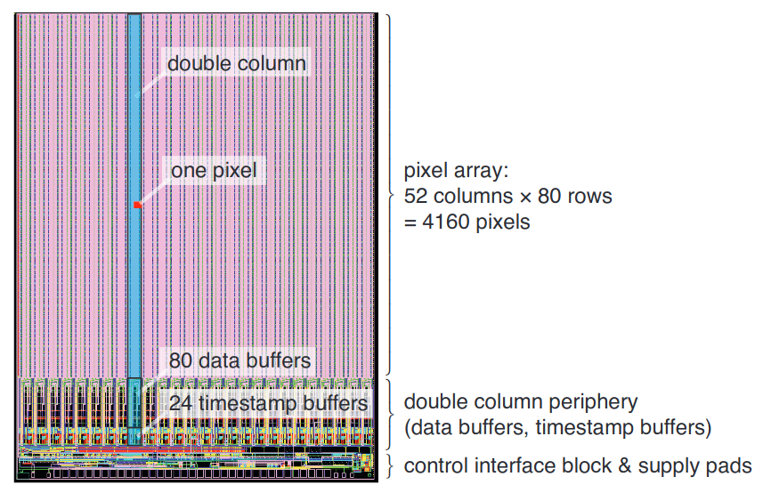
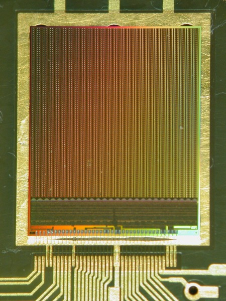
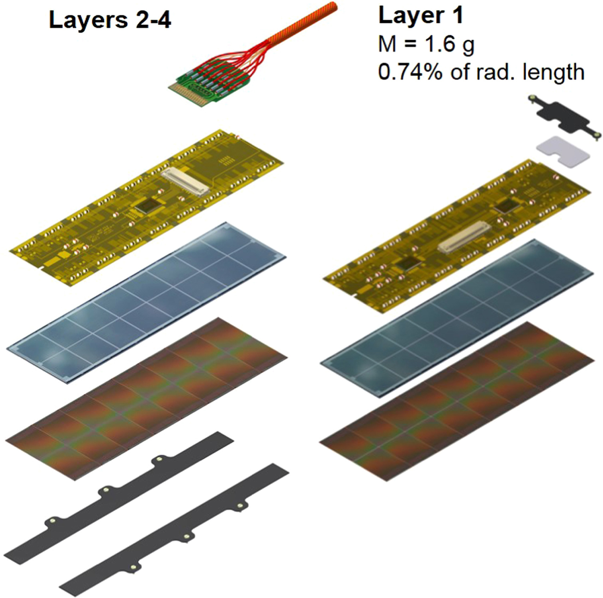

# Basic concepts

Before diving deeper into the software itself, some terms and concepts must be covered
so that the reader does not get lost in the abundance of terminology
and jargon that pervades anything CERN-related.

Your companion glossary can always be found
[here](https://twiki.cern.ch/twiki/bin/view/CMSPublic/WorkBookGlossary).

!!! warning

	There might be lots of inaccuracies in this document. Don't judge me!
	
## General CERN Jargon

### Phase 0, Phase 1, Phase 2, ...

Phases are periods during which the detectors' hardware has more or less the 
same capabilities. When large-scale changes and upgrades take place, a new Phase
starts.

Multiple phases may belong to a single Run (see below).

### [LHC] Run 1, Run 2, ... 

Data-taking periods, which are usually followed by Long Shutdown (LS) periods.
During a Run, multiple Phases may be observed. For example, Phase 0 and Phase 1 took place during
Run 2.

Runs' schedule can be found [here](https://lhc-commissioning.web.cern.ch/schedule/LHC-long-term.htm).

## Hardware

### ADC

Analog to Digital Conversion/Converter. The process of digitizing
an analog signal.

### Pixel Detector

!!! todo
	
	TODO
	
[Comprised of many Pixels](https://cms.cern/detector/identifying-tracks/silicon-pixels), 
the Pixel Detector is part of the whole CMS detector.

In the reconstruction code, the Pixel Detector is represented as a 2D matrix of
pixels (`PixelDigi`s), with X and Y coordinates, each one having an
[ADC](./#adc) value.

### RecHits

!!! todo

	TODO????

### Pixel Cluster

Each time particles pass through the Pixel Detector and interact with it, several 
adjascent Pixels are activated at the same time from each
particle. Those adjascent Pixels form **Clusters**. In other words, a **Cluster** 
is the trace that the particle leaves on the Pixel Detector.

<figure markdown>
  { width="300" }
  <figcaption>A cluster of pixels activated by a particle resembles a stain (Pixel Cluster) on a shirt (Pixel Detector)</figcaption>
</figure>

### Read-Out Chip

Pixel Read-Out Chip (ROC) with 2 x 26 x 80 pixels. A
chip which measures and converts analog signal to digital.

Specification [here](https://twiki.cern.ch/twiki/bin/view/CMS/Psi46dig).

{ width="500" }

Image taken from [here](https://twiki.cern.ch/twiki/pub/CMS/Psi46dig/psi46digSpec.pdf).

{ width="200" }

### Module

A structure of 2 x 8 Read-Out Chips (ROCs), totalling
2 x 8 x (2 x 26 x 80) = 66560 pixels.

Multiple modules are used in the Pixel Detector.

In the exploded view below, the ROCs can be seen in
the second layer from the top.

{ width="400" }

!!! info

	In software, each module is identified by a unique number.
	This number, called DetId, is used for all detector parts.

## Software

### CMSSW

A [huge repository](https://github.com/cms-sw/cmssw) of software related to CMS
data analysis, reconstruction, also containing various other tools.

Intimidating for beginners, rumors have it that even people that have been
developing with it for ages don't want to touch it, not even with a 10-foot pole.

Resembles a mythic monster, that keeps growing with the passage of time, thriving on
the keyboard strokes of innocent physicists.

<figure markdown>
  { width="800" }
  <figcaption>
  It's not that ugly, CMSSW was just having a bad hair day when this
  pic was taken
  </figcaption>
</figure>

??? quote "Hydra image source"

	[@velinov](https://www.deviantart.com/velinov/art/Hydra-monster-144496963)

### `cmsRun`, `cmsDriver`, `runTheMatrix` etc.

Proceed to the [Tools section](cmssw/tools.md) for more information.

### Configuration files

Most probably referring to 
[`cmsRun` configuration files](https://twiki.cern.ch/twiki/bin/view/CMSPublic/WorkBookConfigFileIntro)

### Pixel Clusterizing

Once data from each pixel has been recorded,
we need to detect **Clusters** of adjascent/neigbouring pixels which
have an ADC value above a certain threshold. This process of detecting
**Clusters** is called **Clusterizing**.

This is implemented in both [CPU](cmssw/cpu/PixelThresholdClusterizer-overview.md)
and [GPU](cmssw/gpu/gpuClustering-overview.md).

### SoA/AoS

Alternative ways to store class variables in memory for **parallel computing**.

In usual class declarations, one might have a class attribute, e.g. `int num_books`. 
When an instance of this class is loaded into memory, `num_books` is most probably close
to other class attributes. Say we have thousands of such class instances and
want to run parallel code on them using only the `num_books` attribute
of each instance. This way, the computer will have to load to memory lots of data
which will stay unused. 

This will degrade performance at low-levels, e.g. cache lines will be filled
with data unrelated to the actual calculations, meaning lots of wasted cycles.

Such an approach is called **Array of Structures (AoS)**, and descrbes using
an array of structures/classes for storing data.

To alleviate the drawbacks of AoS, instead of thousands of class instances
stored as an array, the **Structure of Arrays (SoA)** approach can be used. This
approach suggests using only *one* class instance for all the data one wants to store.

This way, instead of having an `int num_books` attribute in the class, the class now
contains an `int* nums_books` array, which stores the data of **all instances**.

The data are now stored consecutively in RAM when loaded, meaning less memory overhead
and better parallel code performance.

A video explanation may be found [here](https://www.youtube.com/watch?v=ScvpoiTbMKc)

### `DetId`

A unique, 32-bit number, used to identify all CMS detector parts
in CMSSW (mainly code that runs on CPUs).

Defined
[here](https://github.com/cms-sw/cmssw/blob/master/DataFormats/DetId/interface/DetId.h).

More info [here](https://github.com/cms-sw/cmssw/tree/master/Geometry/TrackerGeometryBuilder).

### Run Reconstruction

The result of reconstructing tracks and extracting information from raw CMS Run data.

Those reconstructions are created offline (i.e. after the CMS Run has taken place), and
are split into four types with regard to their accuracy, detail and time passed since
the raw data were taken:

* Stream Express (~20 minutes after data taking)
* Prompt Reconstruction (~48 hours after data taking)
* ReReco ({==??? years after data taking==})
* ReReco Ultra Legacy ({==??? years after data taking==})

### s2i (Source to Image)

A build process for creating docker images directly from the source
code, depending on the source's requirements.

Developed by RedHat, it is one of the available methods for
deploying software on the OpenShift platform.

A general readme on s2i is available
[here](https://github.com/openshift/source-to-image/blob/master/docs/builder_image.md).

PaaS-specific instructions available
[here](https://paas.docs.cern.ch/2._Deploy_Applications/Deploy_From_Git_Repository/2-deploy-s2i-app/).

#### Python s2i

For Django projects, a
[python s2i configuration](https://docs.openshift.com/container-platform/3.11/using_images/s2i_images/python.html)
is used. The source code for this script can be found
[here](https://github.com/sclorg/s2i-python-container).

In general, the python-specific tasks run when creating the
container (e.g. `pip install -r requirements.txt`)
are run in the `assemble` script, found
[here](https://github.com/sclorg/s2i-python-container/blob/master/3.8/s2i/bin/assemble). This scripts also checks if the source code
is a Django project.

The `run` script, found
[here](https://github.com/sclorg/s2i-python-container/blob/master/3.8/s2i/bin/run),
checks for `gunicorn`, `django` and other set environmental
variables (e.g. `APP_SCRIPT`).

These scripts can be augmented by creating custom `assemble` and `run`
scripts, such as
[this one](https://github.com/CMSTrackerDPG/certifier/blob/master/.s2i/bin/assemble),
which was created for CertHelper in order to add custom build-time
secret access tokens for CERN's gitlab.
