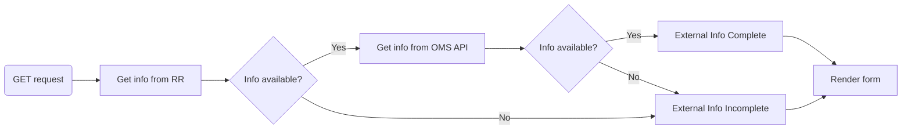
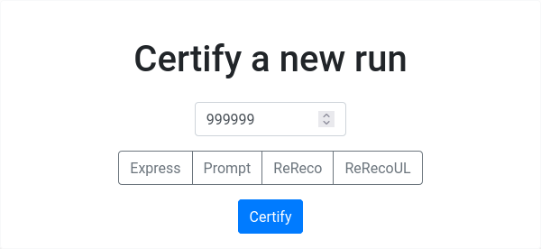

# CertifyView

!!! danger "OOF"

	Possibly the most intricate part of CertHelper, 
	which also requires a lot of refactoring. Brace yourselves.

## Overview

This is a multi-purpose[^1] class-based view which handles the following:

- Renders a __form__ to certify a combination of ^^run number & reconstruction type^^
- Allows the user to submit a complete certification form.

Its final purpose is to guide the user in order
to create `TrackerCertification` objects. As a side-effect, `OmsRun`,
`OmsFill`, `Dataset` and `RunReconstruction` objects are also created.

The user can land on this page from:

- The `/openruns/` page:
    - By selecting a run number and (optionally) a reconstruction type on the
    top form ([`GET` request](#get)).
  
    - By clicking a colored button in the results listed after searching
    for openruns (bottom form, ``GET`` request).
  
- The `/certify/` page:
    - By submitting the complete certification form ([`POST` request](#post))

[^1]: And messy too :weary:

## Inputs

- Run number (`int`, from URL, __required__)
- Reconstruction type (`str`, from URL, _optional_)
- Dataset name (`str`, from `GET` parameters, _optional_, only used
when clicking on colored boxes in `/openruns/`)

## Behavior

### On class creation

This is common behavior for both `GET` and `POST` and is contained
in the
[`dispatch` method](https://docs.djangoproject.com/en/4.0/ref/class-based-views/base/#django.views.generic.base.View.dispatch)
(the part of the view run before checking for `GET` or `POST`),
which is overridden.

- Make sure that a run number and a reconstruction type are specified.
- Make sure that current user is allowed to certify specific reconstruction.
- If certification exists and user is the owner, redirect to update it, else
continue below.
- Make sure an `OmsRun` and `OmsFill` object exists for specific run number.
- Run `GET` or `POST`-specific logic (below).

This procedure could raise:

- `RunReconstructionAllDatasetsCertified` if no uncertified datasets
are found for this run number in RunRegistry. This redirects back
to the `/openruns/` page, so that the user can choose another run number.
- `ConnectionError` if RunRegistry is not accessible, and `ParseError`
if there's some CERN SSO outage
(see issue [#136](https://github.com/CMSTrackerDPG/certifier/issues/136)).
This is pretty much equivalent with `ConnectionError`. In this case, the
user is not allowed to proceed, since there is not enough information. A
reconstruction type should be also supplied.
- `RunRegistryReconstructionNotFound`, `RunRegistryNoAvailableDatasets` if
no info was found on RunRegistry for this specific reconstruction or dataset.
- `OmsApiRunNumberNotFound`, `OmsApiFillNumberNotFound` if no info was
found on OMS API for this run or fill number.

!!! warning "Ok this may be stupid"

	...as this behavior is not probably needed for **both** `GET` and `POST`.
	TO BE REFACTORED AT SOME POINT

### `GET`

- Create a form for the user to certify the reconstruction. This
form also contains information about whether there was complete information
from RunRegistry __and__ OMS API at the time (`external_info_complete`).



!!! info

	`external_info_complete` is updated and set as an attribute to the rendered
	form so that this information is available upon `POST`ing the form back and a
	`TrackerCertification` instance is created, where the `external_info_complete`
	is stored. 

### `POST`

- Get or create a `RunReconstruction` object given the run number and the
reconstruction type.
- If the dataset is specified (e.g. `/Express/Commissioning2022/DQM`),
`get_or_create` a `Dataset` object.
- Parse the `POST`ed form.
- Check whether a `TrackerCertification` object exists for this
combination of parameters, else create it.

### Special cases

#### If only a run number is supplied

This case is valid if the user navigates to `/openruns/` and
only specifies a run number before pressing `Certify`:



The procedure is as follows:

- Try querying the RunRegistry using the supplied run number
to get the next available __uncertified dataset__
(e.g. `/Express/Commissioning2022/DQM`). This is done using
the `rr_retrieve_next_uncertified_dataset` function.
- Then, the __reconstruction type__ is specified, using the dataset
name acquired in the previous step, using the `get_reco_from_dataset`
function (which simply searches for specific keywords in the dataset
string, e.g. in the previous example, the reconstruction type would
be `express`).

#### If a combination of run_number and reconstruction type is specified

Steps specific to this case:

- The dataset is retrieved from RunRegistry using the run number and the
reconstruction type specified (`rr_retrieve_dataset_by_reco`).

The same exceptions raised [above](#on-class-creation) apply.

#### If a dataset is specified but not a reconstruction type

This case applies when the user clicks any of the dataset buttons on
the `/openruns/` page, in the table generated when searching for
open runs.

#### If requested OmsRun and/or RunRegistry information is not available

This can be caused either by:

* CertHelper not having access to
[RunRegistry](../../../../../basic-concepts#run-registry) or OMS API or
* Run number/run reconstruction was not found in RunRegistry or OMS API.

Input fields are presented to the user instead of a display, so that they can
edit the missing OmsRun and OmsFill information manually. This is achieved by
providing two more forms to the `certify.html` template:

* `OmsRunForm` (`omsrun_form`)
* `OmsFillForm` (`omsfill_form`)

Those fields are activated only if the `external_info_complete` attribute
of the certification `form` is set to `False`. For example, for the
`run_type` field of `OmsRun`:

```html

	

	{{ run.run_type|capfirst }}

```
