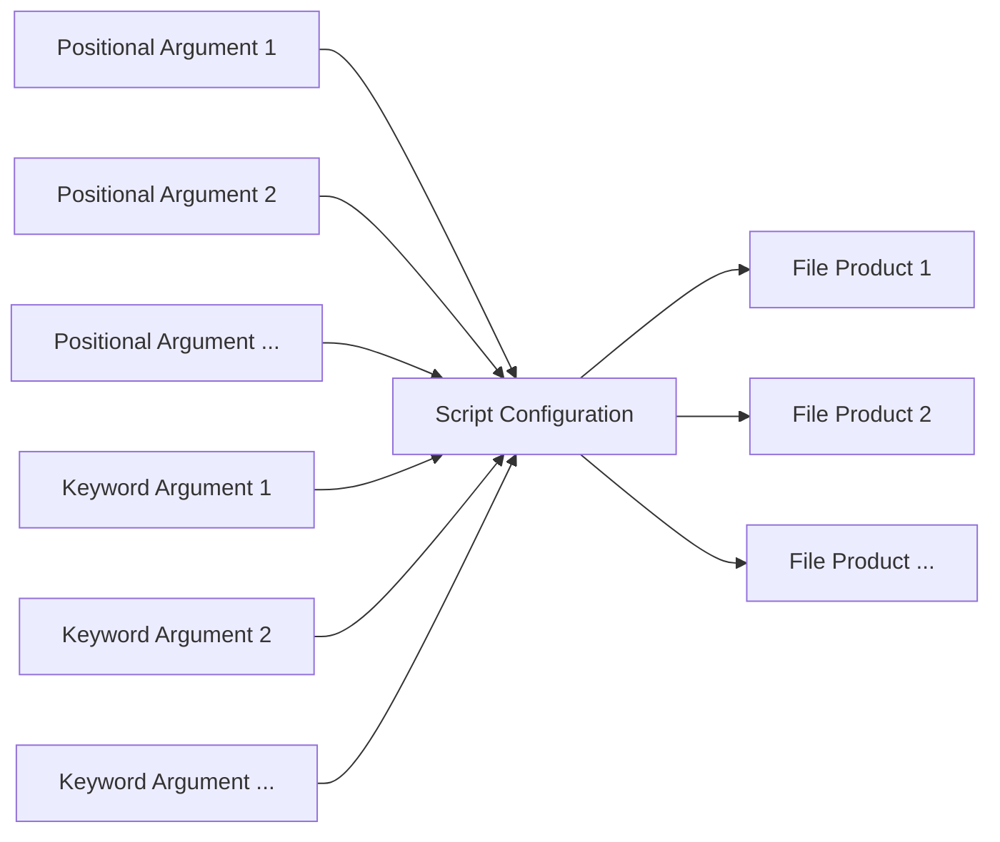
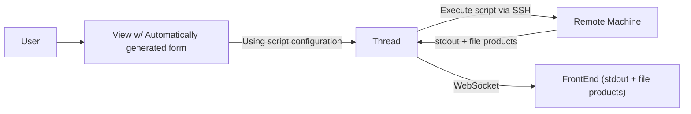

# remotescripts app

Expanding on the `trackermaps` app, this app tries to generalize
remote script execution from certhelper, mainly to facilitate adding
and customizing execution of tools which must be run on other computers
(such as the `vocms066`).

A script configuration is composed of:

* The **script** itself,
* Input **Arguments** (either *positional* or *keyword*) and
* **File products** generated by the script

An overview of the dataflow for executing a script can be seen
below:

[WebSockets](https://en.wikipedia.org/wiki/WebSocket)
are used for real-time updating of the front-end with
the scripts' console output, status updates and images created. This
is implemented by using [Django Channels](https://channels.readthedocs.io/en/stable/),
[channels_redis](https://github.com/django/channels_redis/) and a Redis server
which acts as the backing store.
