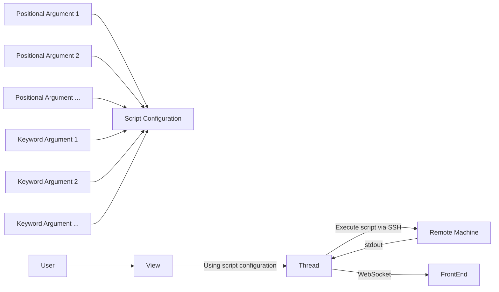

# remotescripts app

Expanding on the `trackermaps` app, this app tries to generalize
remote script execution from certhelper, mainly to facilitate adding
and customizing execution of tools which must be run on other computers
(such as the `vocms066`).

An overview of the dataflow for executing a script can be seen
below:

