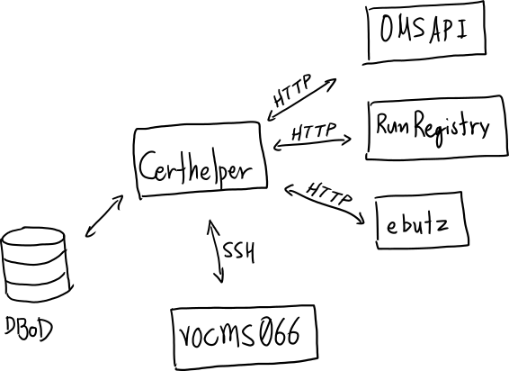
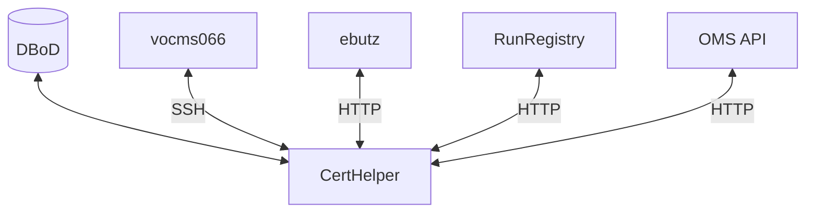

# CertHelper's connectivity

During its operation, CertHelper will try to connect to various remote
resources. An overview can be seen in the sketch below. 

<!--  -->

## Storage

- PostgreSQL database (hosted by CERN's [DBoD service](https://dbod.web.cern.ch/))(__required__)

## APIs

- [OMS API](https://vocms0185.cern.ch/agg/api), for getting run and fill information
(in `omsapi` app and `oms/utils.py` as of writing)
- [CMS Run Registry](https://cmsrunregistry.web.cern.ch/), for getting
reconstruction and dataset information (in `oms/utils.py` as of writing)
- [ebutz's](http://ebutz.web.cern.ch/ebutz/cgi-bin/getReadOutmode.pl) personal
tools, for getting extra information for Reference Runs (in `tables.py` as of writing)

## Tools

- Trackermaps generation script on `vocms066.lxplus.cern.ch` (accessed via SSH,
see `trackermaps/views.py`)
