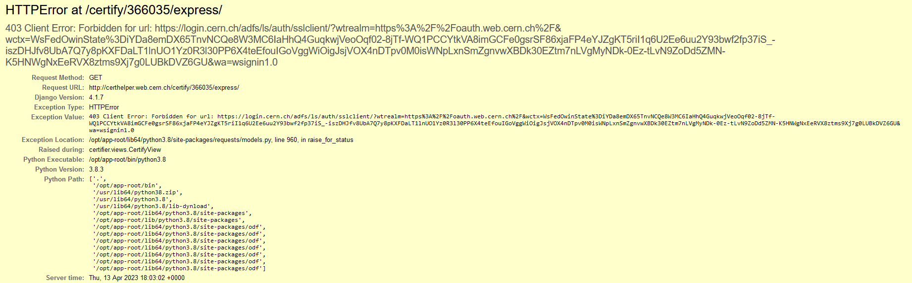

# FAQ

## Errors

### I keep getting `403 Client Error: Forbidden for url` when trying to certify a new reconstruction.

If an error like the following appears:

It may be related to [this issue](https://github.com/CMSTrackerDPG/certifier/issues/97). Regenerating and replacing the grid credentials used by Certhelper may solve the issue.

To do that:

1. You need access to the `/eos/user/t/tkdqmdoc/private` directory, where the `usercert.pem` and `userkey.pem` files reside. Contact TkDPG for access.
2. Regenerate a [Grid Certificate](https://ca.cern.ch/ca/user/Request.aspx?template=EE2User).
3. [Convert](https://ca.cern.ch/ca/Help/?kbid=024100) the certificate to a PEM keypair (`usercert.pem`, `userkey.pem`).
4. Replace the `usercert.pem`, `userkey.pem` files in `/eos/user/t/tkdqmdoc/private`.
5. No restart of the app should be required.
