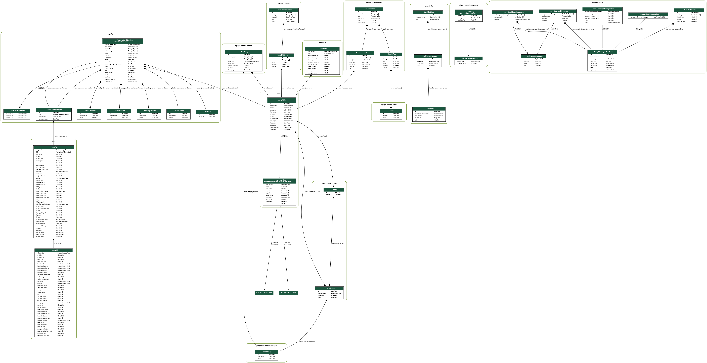

# Introduction

!!! todo
	
	TODO

A Django project, focused on providing tools for Tracker Offline Shifters
and Shift Leaders.

It's deployed on CERN's PaaS platform.

## Code

- [GitHub repo](https://github.com/CMSTrackerDPG/certifier/)

## User manual

- [User manual on readthedocs.io](https://certifier.readthedocs.io/)

## Models structure

The relationship of the models defined in CertHelper's apps
can be seen below:

