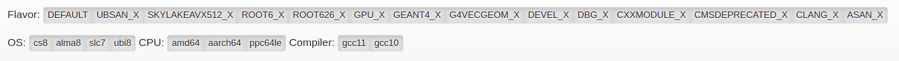
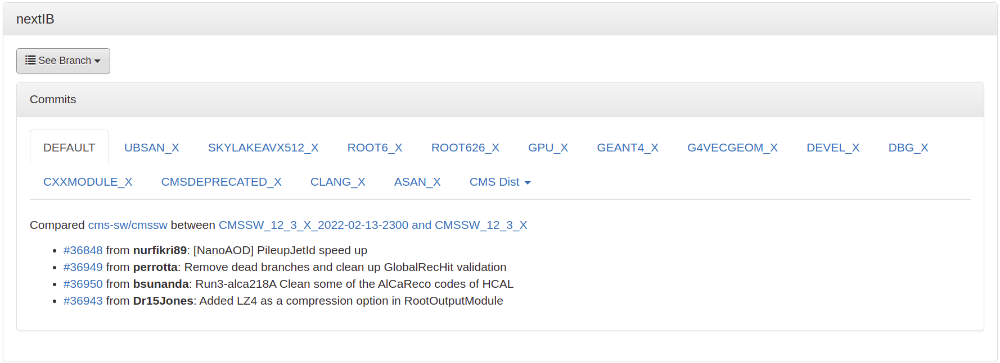

# CMSSW Builds

CMSSW has multiple releases, information about which one can find [here](https://cmssdt.cern.ch/SDT/ReleaseNotes/index.html). 

Builds can be categorized either as **Stable/Pre-releases** or **Integration Builds (IB)**.

## Stable and pre-releases

Find out what's new in a particular release: [https://cmssdt.cern.ch/SDT/ReleaseNotes/index.html](https://cmssdt.cern.ch/SDT/ReleaseNotes/index.html).

For example, for release `CMSSW_12_3_0_pre2`:

!!! quote 

	Changes since CMSSW_12_3_0_pre1:
	
	[compare to previous](https://github.com/cms-sw/cmssw/compare/CMSSW_12_3_0_pre1...CMSSW_12_3_0_pre2)
	
	[36515](http://github.com/cms-sw/cmssw/pull/36515) from **@cms-tsg-storm:** Revert EI removal in TSG tests `hlt` created: 2021-12-16 07:48:39 merged: 2021-12-16 09:48:40
	
	[36506](http://github.com/cms-sw/cmssw/pull/36506) from **@bsunanda:** Run3-TB64 Make some simple changes to the classes in SimG4CMS/HcalTestBeam `simulation` created: 2021-12-15 15:29:55 merged: 2021-12-16 07:05:18
	
	[36505](http://github.com/cms-sw/cmssw/pull/36505) from **@kpedro88:** restrict number of events for 0T PU workflows `pdmv` `upgrade` created: 2021-12-15 10:28:32 merged: 2021-12-15 14:50:12
	
etc.

[https://cmssdt.cern.ch/SDT/ReleaseNotes/CMSSW_12/CMSSW_12_3_0_pre2.html](https://cmssdt.cern.ch/SDT/ReleaseNotes/CMSSW_12/CMSSW_12_3_0_pre2.html)

## Integration builds

Integration builds are automatically built on a schedule.

Browse available integration builds, profiling and other test results: [https://cmssdt.cern.ch/SDT/html/cmssdt-ib/](https://cmssdt.cern.ch/SDT/html/cmssdt-ib/).

Important features include the ability to filter `IBs` based on

* Flavor
* OS
* CPU architecture
* Compiler

Look at latest commits, PRs added for a particluar build

