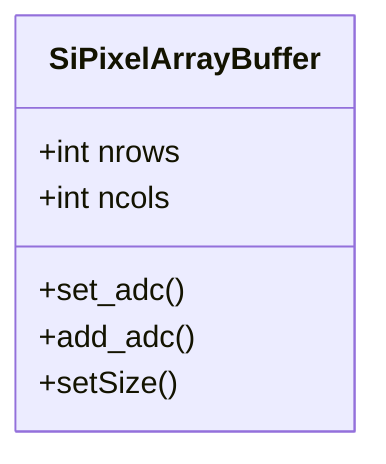

# SiPixelArrayBuffer overview

A class representing a 2D matrix holding information on the Pixels of 
the Pixel Detector.

The [`theBuffer` attribute](PixelThresholdClusterizer-overview.md#thebuffer)
of `PixelThresholdClusterizer` is an instance of `SiPixelArrayBuffer`.

It is located in `RecoLocalTracker/SiPixelClusterizer/plugins`.

## UML diagram

