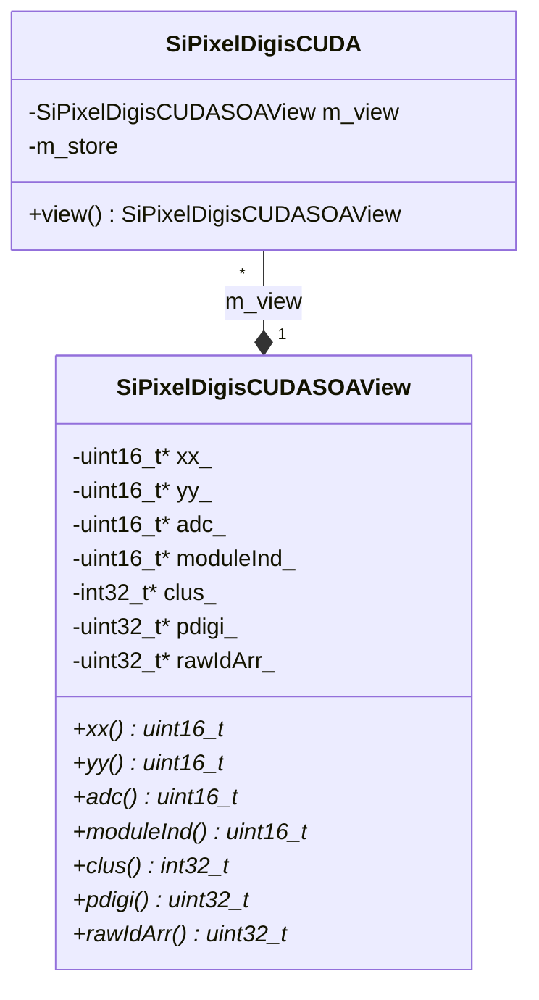

# SiPixelDigisCUDA.h

Class used to contain pixel data (coordinates, ADC values) using the SoA approach,
intended to be used by CUDA code.

The actual data is stored in an instance of
[SiPixelDigisCUDASOAView](SiPixelDigisCUDASOAView.md), which
is accessed by the class' `m_view` attribute, via the `view()`
method.

File on [github](https://github.com/cms-sw/cmssw/blob/master/CUDADataFormats/SiPixelDigi/interface/SiPixelDigisCUDA.h)

## UML diagram

## Methods

### `view`

Accesses the data stored in the `m_view` attribute, which are
stored with the [SoA](../../basic-concepts.md#soaaos) approach.

