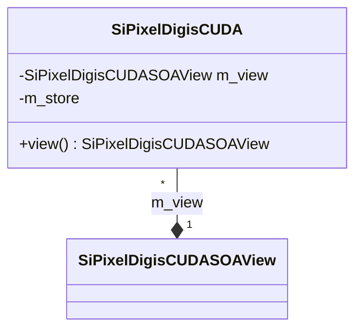

# SiPixelDigisCUDA.h

Class used to contain pixel data (coordinates, ADC values) using the SoA approach,
intended to be used by CUDA code.

The actual data is stored in an instance of
[SiPixelDigisCUDASOAView](SiPixelDigisCUDASOAView.md) (`m_view` attribute),
accessed via the `view()` method.

File on [github](https://github.com/cms-sw/cmssw/blob/master/CUDADataFormats/SiPixelDigi/interface/SiPixelDigisCUDA.h).

## UML diagram

## Attributes

### `m_view`

An instance of
[SiPixelDigisCUDASOAView](SiPixelDigisCUDASOAView.md).
Stores all the Pixel Digi data as SoA.

### `m_store`

!!! todo

	TODO

## Methods

### `view`

Accesses the data stored in the `m_view` attribute, which are
stored with the [SoA](../../basic-concepts.md#soaaos) approach.
