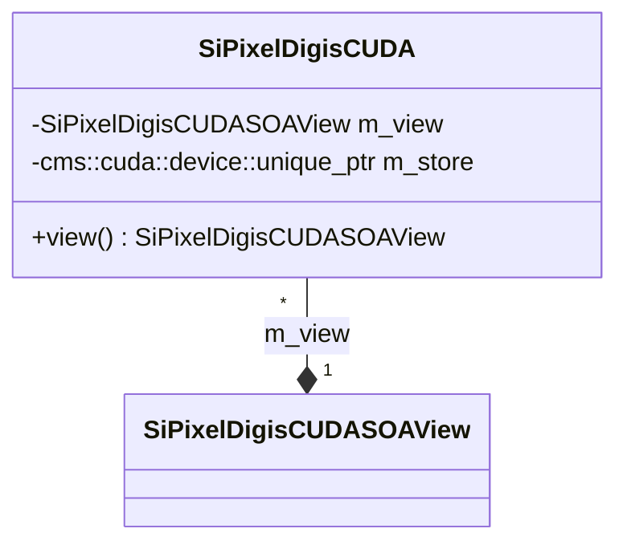

# SiPixelDigisCUDA.h

Class used to contain pixel data (coordinates, ADC values) using the SoA approach,
intended to be used by CUDA code.

The actual data is stored in an instance of
[SiPixelDigisCUDASOAView](SiPixelDigisCUDASOAView.md) (`m_view` attribute),
accessed via the `view()` method.

Header on [github](https://github.com/cms-sw/cmssw/blob/master/CUDADataFormats/SiPixelDigi/interface/SiPixelDigisCUDA.h).

Source on [github](https://github.com/cms-sw/cmssw/blob/master/CUDADataFormats/SiPixelDigi/src/SiPixelDigisCUDA.cc).

## UML diagram

## Attributes

### `m_store`

!!! todo

	This attribute is a pointer to GPU memory. What does it store? 
	
Attribute of type `cms::cuda::device::unique_ptr<StoreType[]>`
(from [HeterogeneousCore](https://github.com/cms-sw/cmssw/blob/master/HeterogeneousCore/CUDAUtilities/interface/device_unique_ptr.h))
, where `StoreType` is `uint16_t`. This is a pointer to an array
stored on GPU memory.

It is initialized by default in the `SiPixelDigisCUDA` constructor, and
is then passed on as a parameter to initialize `m_view`.
See the [Constructor](./#constructor) below for more information.

### `m_view`

An instance of
[SiPixelDigisCUDASOAView](SiPixelDigisCUDASOAView.md).
Stores all the Pixel Digi data as SoA.

## Methods

### Constructor

Gets a number of `maxFedWords` ({==number of pixels??==}) and a **CUDA stream**
as inputs.

Initializes the `m_store` and `m_view` attributes.

`m_store` is initialized using the `cms::cuda::make_device_unique` function
(found in [HeterogeneousCore](https://github.com/cms-sw/cmssw/blob/master/HeterogeneousCore/CUDAUtilities/interface/device_unique_ptr.h)),
by giving it the `maxFedWords` multiplied by the `kMAX` constant
found in the `StorageLocation` enumerator as input.

!!! todo

	What is the meaning of the number produced by the multiplication
	above?
	
	i.e. `kMAX * maxFedWords`
	
	Probably the memory size allocated on the device for storing
	the `SiPixelDigisCUDASOAView` instance?

### `view`

Accesses the data stored in the `m_view` attribute, which are
stored with the [SoA](../../basic-concepts.md#soaaos) approach.
