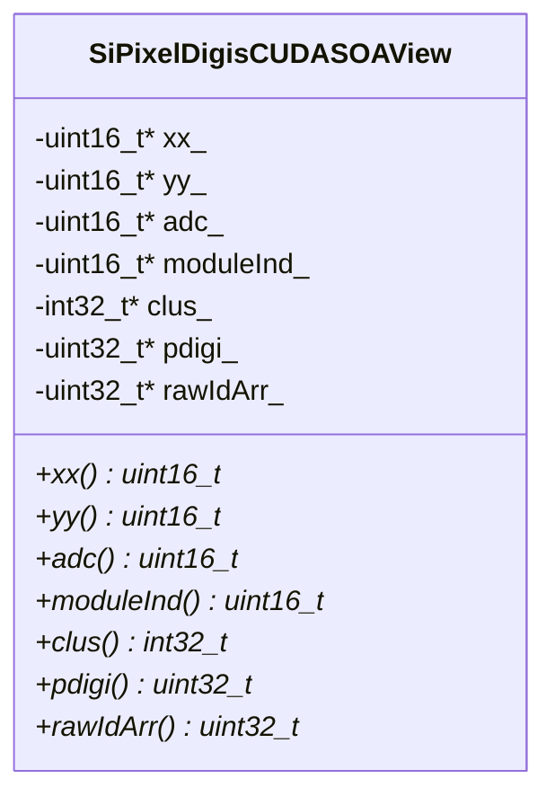

# SiPixelDigisCUDASOAView

Class which stores data in an [SoA](../../basic-concepts.md#soaaos) approach.
Used indirectly by [SiPixelDigisCUDA](SiPixelDigisCUDA) instances, such as the `digis_d`
variable in the
[SiPixelRawToClusterGPUKernel](SiPixelRawToClusterGPUKernel-overview.md#digis_d)
class.

File on
[github](https://github.com/cms-sw/cmssw/blob/master/CUDADataFormats/SiPixelDigi/interface/SiPixelDigisCUDASOAView.h).

Key contents of this class:

* `xx_`: x-coordinates of pixels (array)
* `yy_`: y-coordinates of pixels (array)
* `adc_`: ADC values for each pixel (array)
* `moduleInd_`: {==???==}
* `clus_`: {==Clusters???==}
* `pdigi_`: {==???==}
* `rawIdArr_`: {==???==}

## UML Diagram

!!! todo

	Explain how this works

