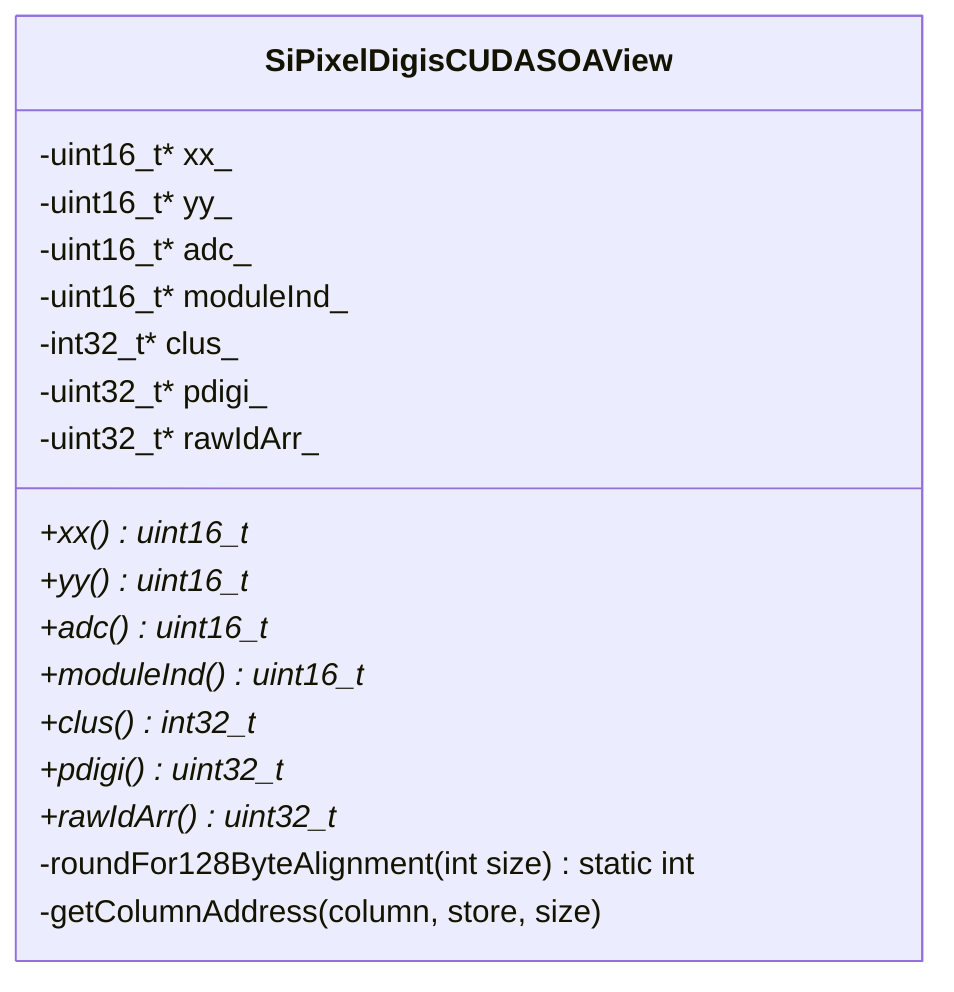

# SiPixelDigisCUDASOAView

Class which stores Pixel digi data in an [SoA](../../basic-concepts.md#soaaos) approach.
Used indirectly by [SiPixelDigisCUDA](SiPixelDigisCUDA) instances, such as the `digis_d`
variable in the
[SiPixelRawToClusterGPUKernel](SiPixelRawToClusterGPUKernel-overview.md#digis_d)
class.

The data is stored on the GPU.

File on
[github](https://github.com/cms-sw/cmssw/blob/master/CUDADataFormats/SiPixelDigi/interface/SiPixelDigisCUDASOAView.h).

Key attributes of this class:

* `xx_`: x-coordinates of pixels (array)
* `yy_`: y-coordinates of pixels (array)
* `adc_`: ADC values for each pixel (array)
* `moduleInd_`: GPU-specific module identifiers
that each pixel belongs to ({==GPU only==})
* `clus_`: The cluster identifier that each pixel is assigned to.
* `pdigi_`: Packed digi format. Contains coordinates and ADC values in one
variable.
See also [PixelDigi](../cpu/PixelDigi-overview.md#thedata) for the CPU counterpart.
* `rawIdArr_`: Unique identifier used to identify modules in the whole of CMS
({==Find a link to official docs to put here==}).

## UML Diagram

!!! todo

	Explain how this works

## Enums

### `StorageLocation`

{==TODO==}

Indices used for accessing specific parts of SoA data in GPU
memory (?), and to determine the maximum size of the memory 
required to be allocated (`kMAX`).

## Methods

### `getColumnAddress`

A template method for returning the memory address of column `column`
(typename `LocationType`)

Used by the `SiPixelDigisCUDASOAView` class constructor to assign
a device pointer to the SoA variables (`xx_`, `yy_`..).

### `roundFor128ByteAlignment`

A method for calculating the number of `uint16_t` elements that
must be requested in order to always have 128-byte memory
transactions ({==Could have something to do with
[this](https://developer.nvidia.com/blog/how-access-global-memory-efficiently-cuda-c-kernels/)==}).

For example, if we want to transfer only 1 `uint16_t` variable (usually
has a size of 2 bytes), one would have to round this up to the nearest
128-byte transaction, meaning that we should request 64 `uint16_t` variables
(because `64 * sizeof(uint16_t) = 128`) to be efficient. Similary,
if we needed 64 `uint16_t`, we would still need one 128-byte transaction.
However, for 65 `uint16_t`, we would need 2 x 128-byte transfers.

