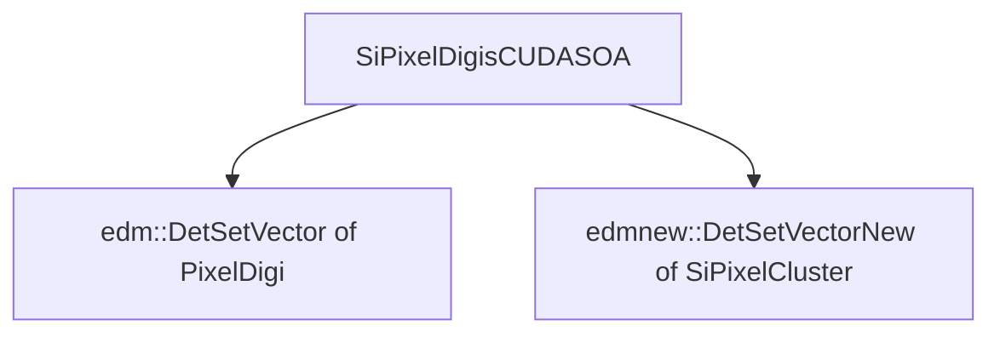

# SiPixelDigisClustersFromSoA

Link on [github](https://github.com/cms-sw/cmssw/blob/CMSSW_12_4_6/RecoLocalTracker/SiPixelClusterizer/plugins/SiPixelDigisClustersFromSoA.cc).

After the [CUDA to SoA conversion](SiPixelDigisSoAFromCUDA-overview.md) has executed,
the data (which is in [`SiPixelDigisCUDASOA`](SiPixelDigisCUDASOAView.md) format)
is copied to DetSetVectors (of [`PixelDigi`s](../cpu/PixelDigi-overview.md)
and [`SiPixelCluster`s](../cpu/SiPixelCluster-overview.md))

!!! warning
	
	- For clusters (stored in the `outputClusters` variable), an  `edmnew::DetSetVector<SiPixelCluster>` is used (a.k.a `SiPixelClusterCollectionNew`, found in [`SiPixelCluster.h`](../cpu/SiPixelCluster-overview.md)).
	- For pixel digis (stored in the `collection` variable), an `edm::DetSetVector` of [`PixelDigi`s](../cpu/PixelDigi-overview.md) is used. 
