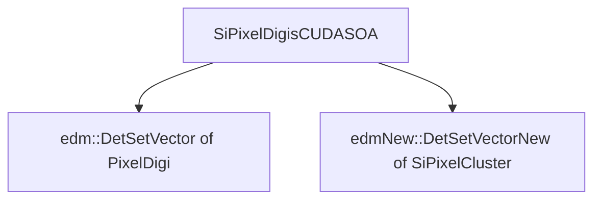

# SiPixelDigisClustersFromSoA

Link on [github](https://github.com/cms-sw/cmssw/blob/master/RecoLocalTracker/SiPixelClusterizer/plugins/SiPixelDigisClustersFromSoA.cc).

After the [CUDA to SoA conversion](SiPixelDigisSoAFromCUDA-overview.md) has executed,
the data (which is in [`SiPixelDigisCUDASOA`](SiPixelDigisCUDASOAView.md) format)
is copied to `edm::DetSetVector`s (of [`PixelDigi`s](../cpu/PixelDigi-overview.md)
and `edmNew::DetSetVector`s of [`SiPixelCluster`s](../cpu/SiPixelCluster-overview.md))

See also: [`edm::DetSetVector`](../cpu/DetSetVector-overview.md).

!!! warning
	
	- For clusters (stored in the `outputClusters` variable), an  `edmNew::DetSetVector<SiPixelCluster>`
	is used (a.k.a `SiPixelClusterCollectionNew`, found in
	[`SiPixelCluster.h`](../cpu/SiPixelCluster-overview.md)).
	- For pixel digis (stored in the `collection` variable), an `edm::DetSetVector<PixelDigi>` 
	is used (see [`PixelDigi`s](../cpu/PixelDigi-overview.md)). 
