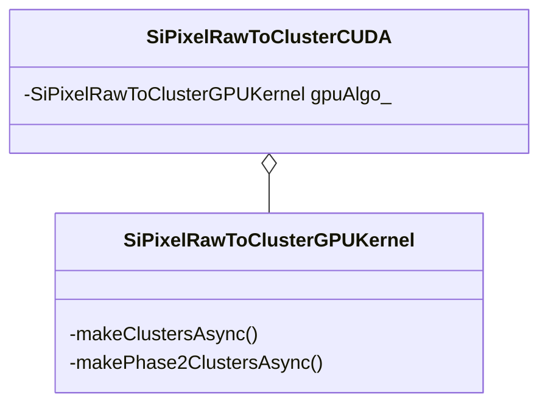

# SiPixelRawToClusterCUDA.cc

File containing the wrapper class which wraps the [`SiPixelRawToClusterGPUKernel`](SiPixelRawToClusterGPUKernel-overview.md) class.

File on [github](https://github.com/cms-sw/cmssw/blob/master/RecoLocalTracker/SiPixelClusterizer/plugins/SiPixelRawToClusterCUDA.cc).

## UML diagram

## Class attributes

### `gpuAlgo_`

An instance of [`SiPixelRawToClusterGPUKernel`](SiPixelRawToClusterGPUKernel-overview.md)
