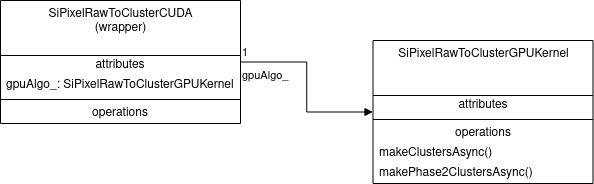

# SiPixelRawToClusterCUDA

Wrapper class which wraps the [`SiPixelRawToClusterGPUKernel`](SiPixelRawToClusterGPUKernel-overview.md) class.

## UML diagram

## Class attributes

### `gpuAlgo_`

An instance of [`SiPixelRawToClusterGPUKernel`](SiPixelRawToClusterGPUKernel-overview.md)
