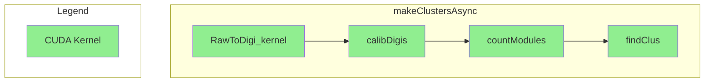

# SiPixelRawToClusterGPUKernel

File containing the `pixelgpudetails` namespace which in turn contains:

- A class of the same name  which,
  among other things, contains:
	- The `makeClustersAsync` method
- CUDA kernels:
	- `RawToDigi_kernel`

Files on github: [header](https://github.com/cms-sw/cmssw/blob/master/RecoLocalTracker/SiPixelClusterizer/plugins/SiPixelRawToClusterGPUKernel.h) and [source](https://github.com/cms-sw/cmssw/blob/master/RecoLocalTracker/SiPixelClusterizer/plugins/SiPixelRawToClusterGPUKernel.cu).

## `SiPixelRawToClusterGPUKernel` Class

An instance of this class is created and called by the
[`SiPixelRawToClusterCUDA`](SiPixelRawToClusterCUDA-overview.md)) class.

### `makeClustersAsync`

A function that implements the following functionality:

- Converts Raw Pixel data to Digis (by calling the `RawToDigi_kernel`)
- Calibrates the Digis (by calling the [`calibDigis.md`](gpuCalibPixel-calibDigis.md) kernel)
- {==Counts modules(????)==} (by calling the
[`countModules`](gpuClustering-countModules.md) kernel).
- Uses the Digis created in the first step to create Clusters (by calling
the [`findClus`](gpuClustering-findClus.md) kernel)

#### Flowchart

