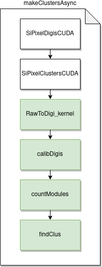

# SiPixelRawToClusterGPUKernel

Nested wrapper class (inside [`SiPixelRawToClusterCUDA`](SiPixelRawToClusterCUDA-overview.md))
which, among other things, contains the `makeClustersAsync` function.

## Class functions

### `makeClustersAsync`

A function that implements the following functionality:

- Converts Raw Pixel data to Digis (by calling the `RawToDigi_kernel`)
- Calibrates the Digis (by calling the [`calibDigis`](calibDigis.md) kernel)
- {==Counts modules(????)==} (by calling the 
[`countModules`](gpuClustering-countModules.md) kernel).
- Uses the Digis created in the first step to create Clusters (by calling
the [`findClus`](gpuClustering-findClus.md) kernel)

### Flowchart

