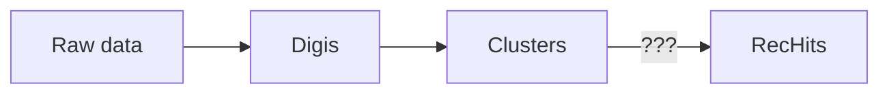

# GPU code overview

!!! todo
	
	TODO

Reconstruction modules meant to be run on nvidia GPUs. 

Functionality covered in this documentation:

- [Raw to Digi conversion](SiPixelRawToClusterCUDA-overview.md)
- [Clusterization](SiPixelRawToClusterCUDA-overview.md)

