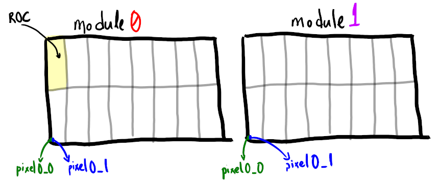

# GPU code overview

!!! todo
	
	TODO

Reconstruction modules meant to be run on nvidia GPUs. 

Functionality covered in this documentation:

- [Raw to Digi conversion](SiPixelRawToClusterCUDA-overview.md)
- [Clusterization](SiPixelRawToClusterCUDA-overview.md)

## Data Structure

The [SoA](../../basic-concepts.md#soaaos) approach is used to store
pixel data used by the CUDA code.

In short, data from each [module](../../basic-concepts.md#module)
is concatenated into multiple 1D arrays.

For example, suppose we have two modules (module0 and module1).
Each one will contain 16 x 80 x 52 = 66560 pixels. Each pixel has
its module coordinates (`x` and `y`) and the module index it belongs
to (`moduleInd`, for this example `0` and `1`).

A simplistic visualization of the example above can be seen
below; each module is composed of 2 x 8
[ROCs](../../basic-concepts.md#read-out-chip), each pixel having
unique coordinates relative to the module.

The SoA approach to store the pixel data would look like
the image below; data from all modules are concatenated one after
another in 1D arrays:

{ width="500" }

An actual example of such arrays can be seen in the
[SiPixelDigisCUDASOAView](./SiPixelDigisCUDASOAView.md).

!!! todo

	Where is this data structure created? Unpacking?
