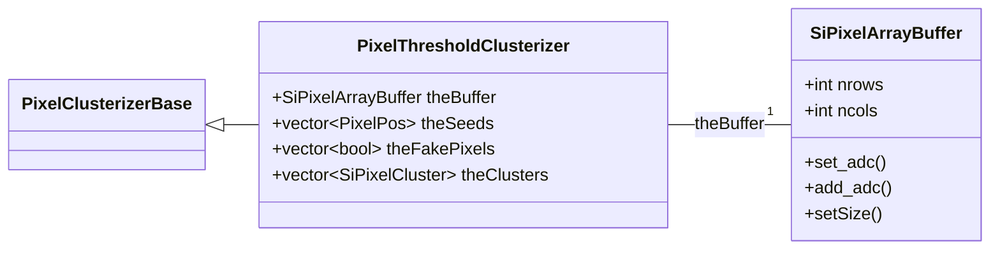

# PixelThresholdClusterizer overview

Located in `RecoLocalTracker/SiPixelClusterizer/plugins/` in CMSSW, these files
(`PixelThresholdClusterizer.h` and `.cc`) provide the declaration of the 
`PixelThresholdClusterizer` class.

It inherits from `PixelClusterizerBase` (declared in the same directory, in
`PixelClusterizerBase.h`).

The class' main purpose is to create [Clusters](../../../basic-concepts.md#pixel-cluster), given [`PixelDigi`s](PixelDigi-overview.md).

Other functionality has been integrated in it, such as:

- Duplicate Digi removal

## UML diagram

## Class attributes

### `theBuffer`

A 2D matrix of [`SiPixelArrayBuffer`](SiPixelArrayBuffer-overview.md) type. Its purpose is to represent the Pixel
Detector and store ADC values for each Pixel.

### `thePixelOccurence`

A simple vector of type `uint8_t` to store the number of occurences that each
Digi is encountered. Used to detect duplicates due to noise. 

### `thePixelThreshold`

A constant ADC threshold above which a pixel is regarded as active. 

### `theSeedThreshold`

A constant ADC threshold above which an active pixel is also considered as a **Seed**,
i.e. a starting point for the Clusterization algorithm.
