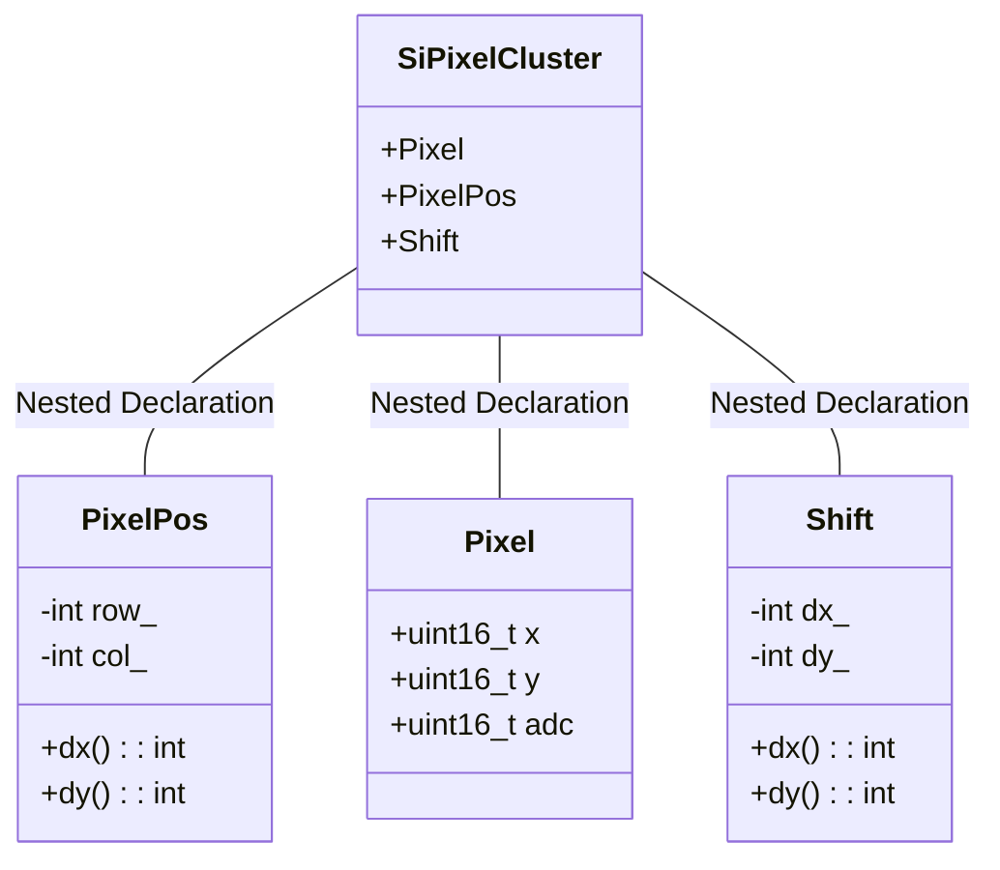

# SiPixelCluster overview

Located in `DataFormats/SiPixelCluster/interface`, the `SiPixelCluster.h` contains
the declaration of the `SiPixelCluster` class. 

From the source file's header:

!!! quote

	Class to contain and store all the topological information of pixel clusters:
	charge, global size, size and the barycenter in x and y
	local directions. It builds a vector of SiPixel (which is
	an inner class) and a container of channels.

In it, three helper subclasses are contained:

- `Pixel`
- `PixelPos`
- `Shift`

## UML diagram

