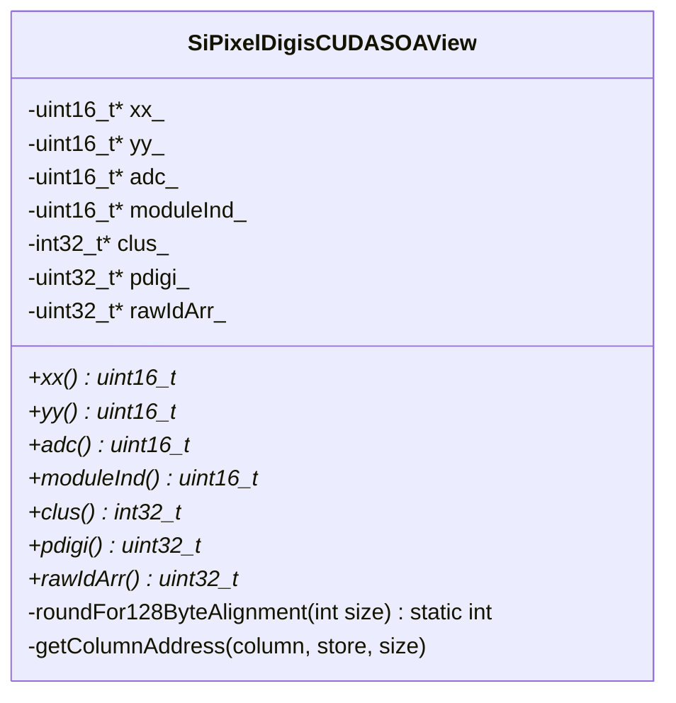
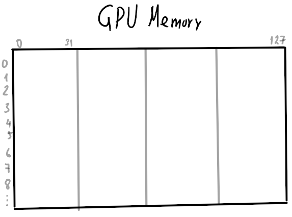
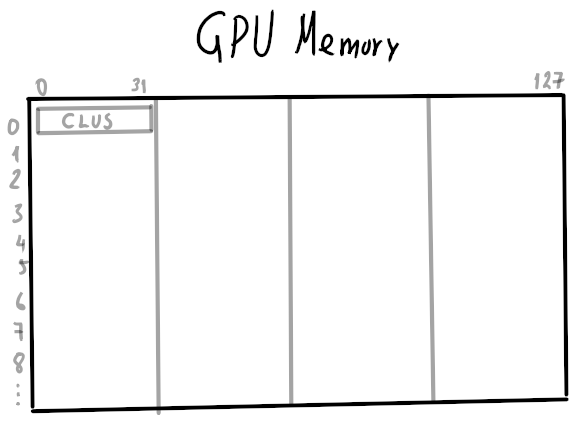
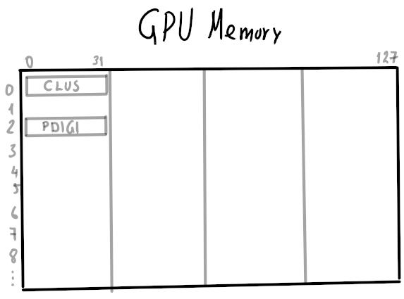
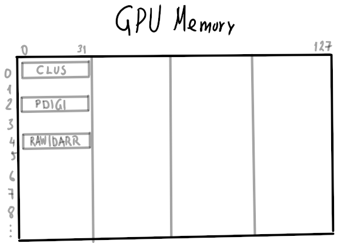
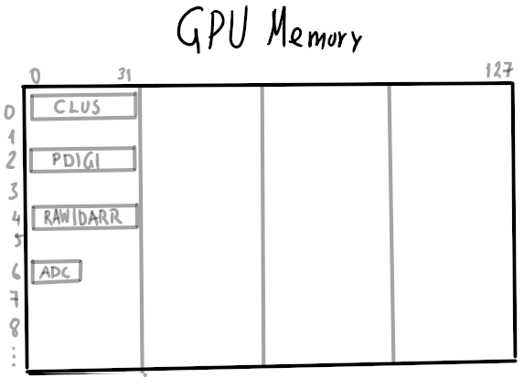
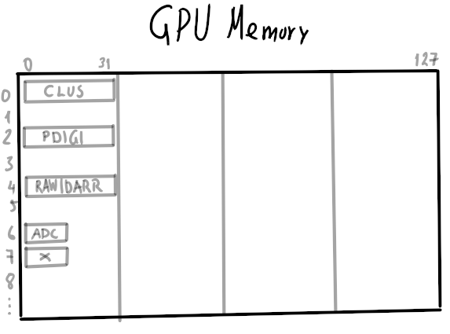
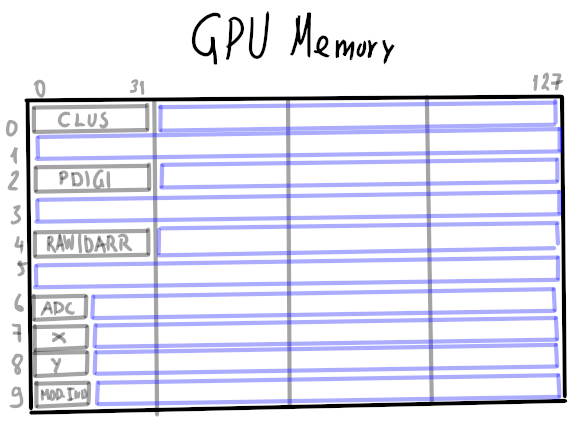
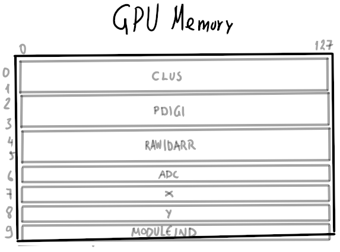

# SiPixelDigisCUDASOAView

Class which stores Pixel digi data in an [SoA](../../../basic-concepts.md#soaaos) approach.
Used indirectly by [SiPixelDigisCUDA](SiPixelDigisCUDA.md) instances, such as the `digis_d`
variable in the
[SiPixelRawToClusterGPUKernel](SiPixelRawToClusterGPUKernel-overview.md#digis_d)
class.

The data is stored on the GPU.

File on
[github](https://github.com/cms-sw/cmssw/blob/master/CUDADataFormats/SiPixelDigi/interface/SiPixelDigisCUDASOAView.h).

Key attributes of this class:

* `xx_`: x-coordinates of pixels (array)
* `yy_`: y-coordinates of pixels (array)
* `adc_`: ADC values for each pixel (array)
* `moduleInd_`: GPU-specific module identifiers
that each pixel belongs to ({==GPU only==})
* `clus_`: The cluster identifier that each pixel is assigned to.
* `pdigi_`: Packed digi format. Contains coordinates and ADC values in one
variable.
See also [PixelDigi](../cpu/PixelDigi-overview.md#thedata) for the CPU counterpart.
* `rawIdArr_`: Unique identifier used to identify modules in the whole of CMS
({==TODO: Double-check that this is the same as 
[`DetId`](../../../basic-concepts.md#detid)==}).

## UML Diagram



!!! todo

	Explain how this works
## Contents

### Enums

#### `StorageLocation`

{==TODO==}

Indices used for accessing specific parts of SoA data in GPU
memory (?), and to determine the maximum size of the memory 
required to be allocated (`kMAX`).

### Methods

#### `getColumnAddress`

A template method for returning the memory address of column `column`
(typename `LocationType`)

Used by the `SiPixelDigisCUDASOAView` class constructor to assign
a device pointer to the SoA variables (`xx_`, `yy_`..).

#### `roundFor128ByteAlignment`

A method for calculating the number of `uint16_t` elements that
must be requested in order to always have 128-byte memory
transactions ({==Could have something to do with
[this](https://developer.nvidia.com/blog/how-access-global-memory-efficiently-cuda-c-kernels/)==}).

For example, if we want to transfer only 1 `uint16_t` variable (usually
has a size of 2 bytes), one would have to round this up to the nearest
128-byte transaction, meaning that we should request 64 `uint16_t` variables
(because `64 * sizeof(uint16_t) = 128`) to be efficient. Similary,
if we needed 64 `uint16_t`, we would still need one 128-byte transaction.
However, for 65 `uint16_t`, we would need 2 x 128-byte transfers.

It's used mainly for pointer arithmetic, for calculating the offset
that the pointer will have to move to find the start of a specific
SoA variable, e.g. the `adc_` array.

#### Constructor

!!! todo

	TODO

## Memory Structure

As mentioned, efficient GPU global memory transactions must be
[32-, 64- or 128-byte aligned](https://developer.nvidia.com/blog/how-access-global-memory-efficiently-cuda-c-kernels/), therefore all memory storage
and accesses are best done in chuncks of the aforementioned sizes.

For this code, 128-byte chunks have been chosen by the developers.

When a `SiPixelDigisCUDASOAView` instance is created, pointers to the
start of each SoA variable (`clus_`, `adc_` etc) are created. Those
are calculated using the start of the memory requested (i.e. the pointer
stored in [`m_store`](./SiPixelDigisCUDA.md#m_store)), the constant
assigned to each variable in [`StorageLocation`](#storagelocation) and
the number of pixels available (`maxFedWords`).

!!! note

	The values in `StorageLocation` (0, 2, 4, 6, 7, 8, 9)
	are not random, but are
	directly related to the data type of the variables. 
	Note that 32-bit variables (`clus_`, `pdigi_` and `rawIdArr_`) are given 
	numbers that have double the size of 16-bit variables
	(`adc_`, `xx_`, `yy_`, `moduleInd_`). For example, note
	that the values of `StorageLocation::kCLUS` and
	`StorageLocation::kPDIGI` differ by 2, while the
	values of `StorageLocation::kADC` and
	`StorageLocation::kXX` differ by 1.
	

Firstly, 32-bit variables are stored in order, i.e.:

* `clus_` (`int32_t`)
* `pdigi_` (`uint32_t`)
* `rawIdArr_` (`uint32_t`)

Then, 16-bit variables are stored, i.e.:

* `adc_` (`uint16_t`)
* `xx_` (`uint16_t`)
* `yy_` (`uint16_t`)
* `moduleInd_` (`uint16_t`)

As an example, let's assume that we want to store information for
8 pixels (`numPixels` = `maxFedWords` = `8`) on the GPU, using
the `SiPixelDigisCUDASOAView` which makes use of the SoA approach.
Upon a `digis_d` instance creation, an `m_store` pointer to the GPU
memory is created, where the data will be stored.
Let's assume that it points to GPU memory location `0`.

<figure markdown>
{ width="400" }
<figcaption>The GPU memory, initially empty</figcaption>
</figure>

### `clus_`

To find out where the first variable will be stored (i.e. the first
constant in `StorageLocation`, `kCLUS`), we check the assignment done
in the class' [constructor](#constructor):

```c++ linenums="52"
clus_ = getColumnAddress<int32_t>(StorageLocation::kCLUS, store, maxFedWords);
```

The [`getColumnAddress`](#getcolumnaddress) method is called, which will
calculate the memory offset starting from the `store` pointer as:

```
store + kCLUS * roundFor128ByteAlignment(numPixels) = 0 + 0 * 64 = 0
```

!!! note
	
	`roundFor128ByteAlignment` will calculate the minimum number of
	`uint16_t` variables that must be requested, given the number of
	pixels that must be stored. 
	
	For 8 pixels, `roundFor128ByteAlignment` will return `64`, since
	a single block of 64 * `uint16_t`s (i.e. 1 x 128 bytes, since
	a `uint16_t` is 2 bytes) will suffice to fit 8 pixels.

Therefore, since each `clus_` element is an `int32_t` variable, we
will be storing `8 * sizeof(int32_t)` = 32 bytes starting from memory address
0 (calculated by `getColumnAddress` above).

<figure markdown>
{ width="400" }
<figcaption>
The GPU memory, with <b>clus_</b> stored. The data
takes up memory address 0 to 31
</figcaption>
</figure>

### `pdigi_`
Moving on, next in `StorageLocation` is `kPDIGI`, with value `2`.
Similarly, we calculate the initial memory offset that the data will
be stored at by using the `getColumnAddress` method:

```
store + kPDIGI * roundFor128ByteAlignment(numPixels) = 0 + 2 * 64 = 128
```

This number is the offset **counted in `uint16_t`**, meaning **twice this
number in bytes**, meaning 256 bytes offset from the start.

<figure markdown>
{ width="400" }
<figcaption>
The GPU memory, with <b>pdigi_</b> also stored. The data
takes up memory address 256 to 256 + 31
</figcaption>
</figure>

!!! note
	
	Memory addresses 32 to 256, i.e. memory between `clus_` and `pdigi_`,
	remain unused.


### `rawIdArr_`

Similarly for `rawIdArr_` (`kRAWIDARR = 4`):

```
store + kRAWIDARR * roundFor128ByteAlignment(numPixels) = 0 + 4 * 64 = 256
```

<figure markdown>
{ width="400" }
<figcaption>
The GPU memory, with <b>rawIdArr_</b> also stored. The data
takes up memory address 512 to 512 + 31
</figcaption>
</figure>

### `adc_`

Next, `adc_` is stored (`kADC = 6`). These values are of size `uint16_t`,
meaning that, for 8 pixels, this array will take up `8 * sizeof(uint16_t)`
= 16 bytes of memory.

To get the memory location where the data will be stored at, 
we calculate the value returned from `getColumnAddress`:

```
store + kADC * roundFor128ByteAlignment(numPixels) = 0 + 6 * 64 = 384
```

We multiply by two, since this is still an offset counted in `uint16_t`s
and we store `adc_` in memory address 768.

<figure markdown>
{ width="400" }
<figcaption>
The GPU memory, with <b>adc_</b> also stored. The data
takes up memory address 768 to 768 + 31
</figcaption>
</figure>


### `xx_`

`xx_` (`kXX = 7`) is also an `uint16_t` variable, and it is going
to be stored in:

```
store + kXX * roundFor128ByteAlignment(numPixels) = 0 + 7 * 64 = 448
```

Final offset is 896.

<figure markdown>
{ width="400" }
<figcaption>
The GPU memory, with <b>x_</b> also stored. The data
takes up memory address 896 to 896 + 16
</figcaption>
</figure>

### Final structure

After following the same procedure for `yy_` and `moduleInd_`,
we find the final memory structure to look like the one below:

<figure markdown>
{ width="400" }
<figcaption>
The GPU memory, with all variables stored. The memory
that remains unused is marked with light blue.
</figcaption>
</figure>

Parts of the memory will remain unused, depending on the `numPixels`
but, for large number of pixels, the percentage of wasted memory
becomes negligible.

### Special case

What if `numPixels` was `64`? By following the same procedure,
the resulting memory usage would look something like this:

<figure markdown>
{ width="400" }
<figcaption>
The GPU memory, with all variables stored, and
<b>numPixels = 64</b>. No memory is unused.
</figcaption>
</figure>

!!! note

	Any multiple of 64 would result in no wasted memory.
