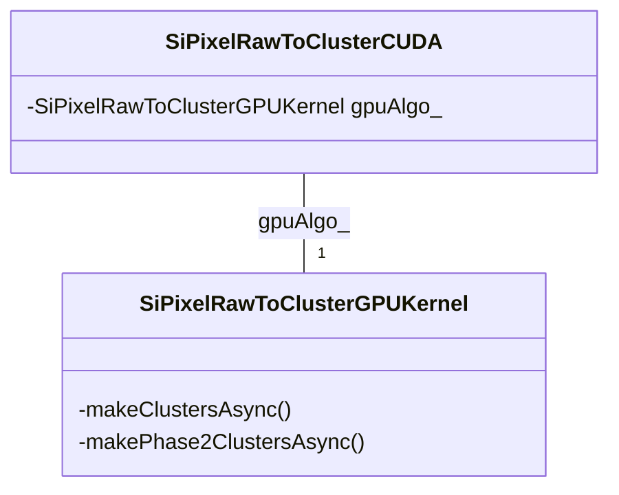

# SiPixelRawToClusterCUDA.cc

File containing the wrapper class which wraps the [`SiPixelRawToClusterGPUKernel`](SiPixelRawToClusterGPUKernel-overview.md) class.

File on [github](https://github.com/cms-sw/cmssw/blob/master/RecoLocalTracker/SiPixelClusterizer/plugins/SiPixelRawToClusterCUDA.cc).

## UML diagram

## Class attributes

### `gpuAlgo_`

An instance of the [`SiPixelRawToClusterGPUKernel`](SiPixelRawToClusterGPUKernel-overview.md)
class, which calls the CUDA kernels.

## Class methods

### `acquire`

This method gets the `Event` and `EventSetup` data and extracts required data from them,
such as `gpuMap` and `words`.

Then, [`gpuAlgo_.makeClustersAsync`](SiPixelRawToClusterGPUKernel-overview.md#makeclustersasync)
is called with the requied params.
