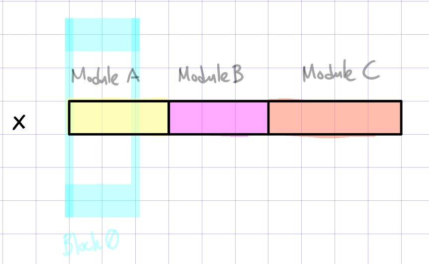
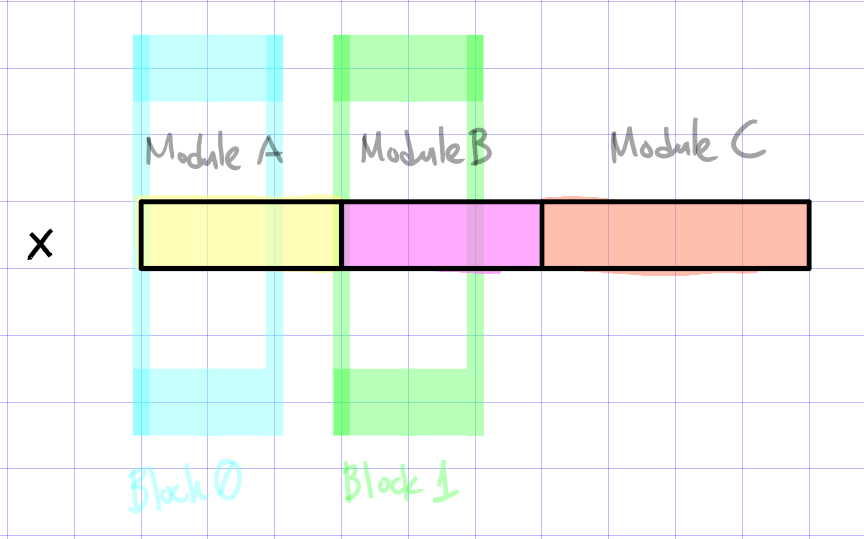
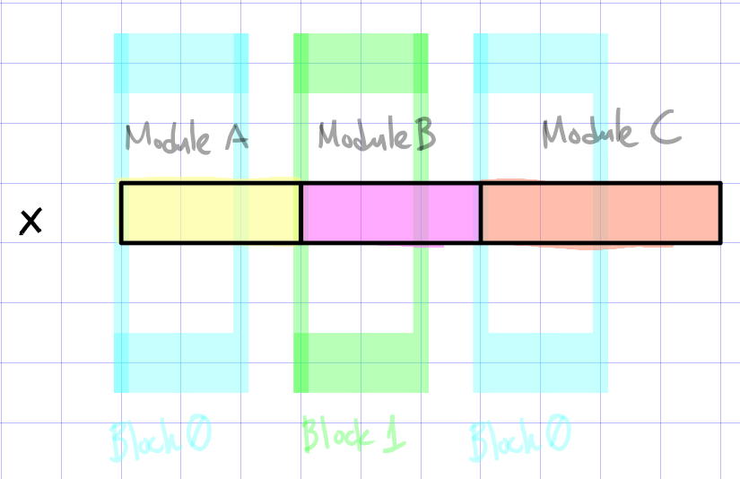
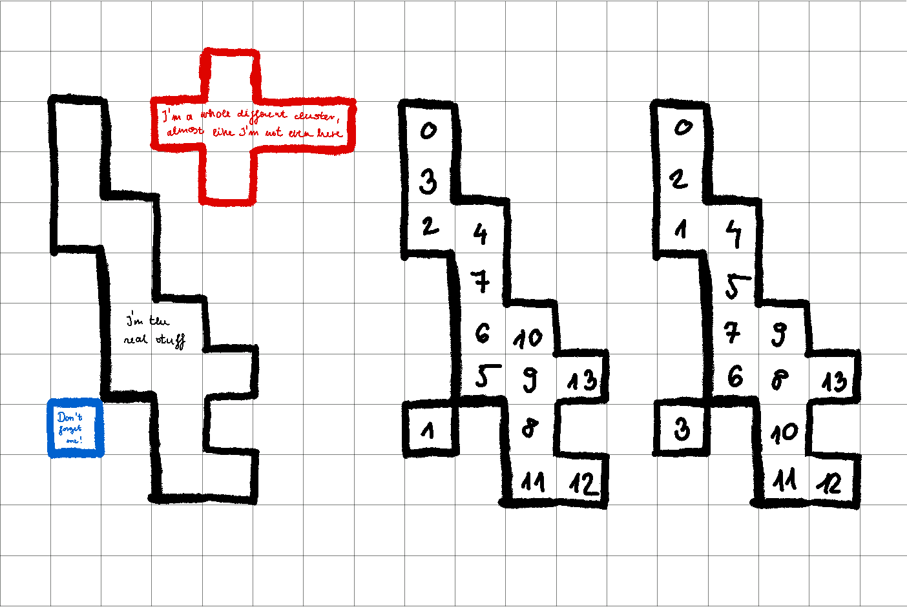
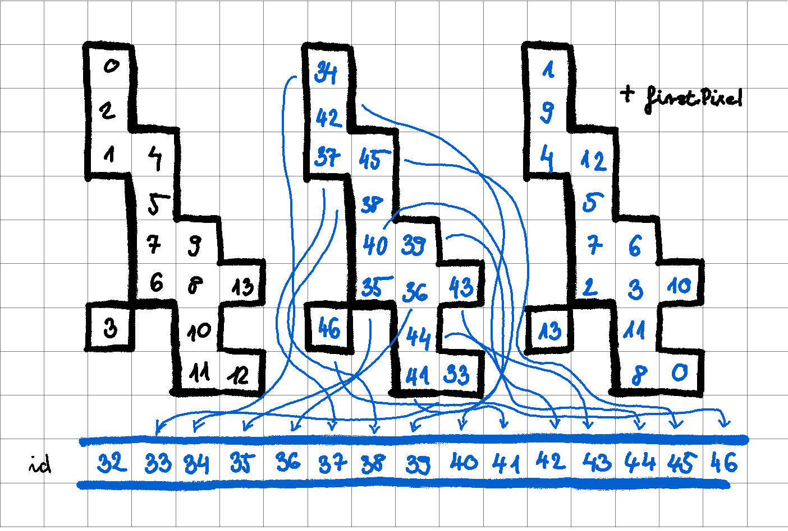
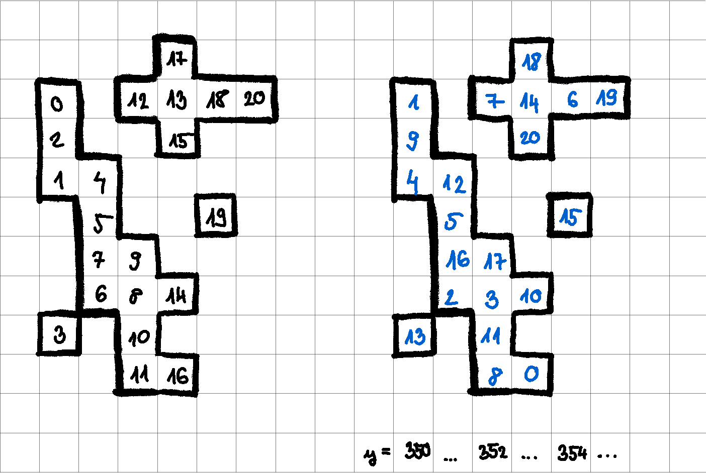

# findClus

CUDA kernel for finding [Clusters](../../../basic-concepts.md#pixel-cluster)
given digis extracted from raw data.

Taking advantage of the [SoA](../../../basic-concepts.md#soaaos) data approach,
it is meant to be executed
with a 1D grid of blocks, each block being a 1D grid
of threads. The number of blocks and threads used to launch this kernel
is equal to the number of modules present in the detector which, in turn,
depends on the Phase:

|         | Blocks | Threads |
|:--------|:-------|:--------|
| Phase 1 | 1856   | 256     |
| Phase 2 | 3892   | 384     |

!!! note 

	The number of blocks is equal to the **number of modules**, which depend
	on the Phase. This number is found in the
	[Geometry/CommonTopologies](https://github.com/cms-sw/cmssw/blob/master/Geometry/CommonTopologies/interface/SimplePixelTopology.h)
	CMSSW module which contains constants related to the Pixel Detector Topology.
	

## Overview

This kernel is launched with **1 block per module**, meaning
that each GPU block will be assigned the digis of 1 module. Then,
each block's thread is assigned 1 or more digis to operate
on.

!!! note "Note 1"
	
	The case to launch this kernel with **less** blocks
	than there are modules is also accounted for, by running
	a first `for` loop in each thread which runs from `firstModule` (i.e.
	the thread's **Block index**) to `endModule` by increments
	of `gridDim.x` (i.e. total number of blocks).

!!! note "Note 2"

	Since the number of threads per block will probably be 
	smaller than the number of digis per module, a single 
	thread will have to take care of doing the calculations
	for more than one digi. 
	
	This is accounted for by a second `for` loop which starts
	at `first` (calculated by using the index stored in `moduleStart`
	and adding the `threadIdx.x`) and iterates up to `numElements` (i.e. total number
	of digis), with increments of `blockDim.x` (i.e. number of threads
	per block)
	


## Arguments

### `wordCounter` [Input]

The total number of pixels for **all** data.

<!-- ### Example -->

<!-- Assuming the following: -->

<!-- * Total number of digis = 10 -->
<!-- * Total number of modules = 3 -->

<!-- The `x` array would look something like: -->

<!--  -->

<!-- This means that the `moduleStart` array will contain -->
<!-- the following (see [`countModules`](gpuClustering-countModules.md) -->
<!-- to understand why): -->

<!-- <table> -->
<!--     <tr> -->
<!--         <th>pos</th><td>0</td><td>1</td><td>2</td><td>3</td><td>4</td><td>5</td><td>6</td> -->
<!--     </tr> -->
<!--     <tr> -->
<!--         <th><code>moduleStart</code></th><td>3</td><td>3</td><td>0</td><td>6</td><td>0</td><td>0</td><td>0</td> -->
<!--     </tr> -->
<!-- </table> -->

<!-- * Kernel is launched with: -->
<!-- 	* 2 blocks -->
<!-- 	* 2 threads per block -->
	
<!-- This means that there are **less** blocks than there are modules,  -->
<!-- and there are **less** threads per block than there are digis per -->
<!-- module. -->

<!-- The first block of threads (**Block 0**) will be assigned Module A: -->

<!--  -->

<!-- Notice that each block has 2 threads, meaning that the  -->
<!-- third element of module A is not directly assigned to  -->
<!-- a dedicated thread.  -->

<!-- Then, **Block 1** is assigned Module B: -->

<!--  -->

<!-- The third module is not explicitly assigned to a block yet. -->

<!-- Using a `for` loop which increments by `gridDim.x`[^1], we can assign -->
<!-- the data of Module C to **Block 0**: -->

<!--  -->

<!-- [^1]: `gridDim.x` is equal to the number of blocks for this kernel. -->

<!-- By using a nested `for` loop which increments by `blockDim.x`[^2], -->
<!-- we can assign a thread to more than one digi, within the same block: -->

<!--  -->

<!-- The thread Ids are shown underneath each array element. -->

<!-- [^2]: `blockDim.x` is equal to the number of threads per block for this kernel. -->
	
<!-- ### Arguments -->

<!-- #### `uint32_t* const* __restrict__ moduleStart` [Input] -->

<!-- This is an array of indices, created by the -->
<!-- [`countModules`](gpuClustering-countModules.md) kernel, -->
<!-- which stores the indices that the data of the next module is stored in all -->
<!-- other arrays (e.g. `x`, `y`). -->


<!-- !!! note "Note 1" -->
	
<!-- 	The only exception is the 0th element, which stores the **total number of -->
<!-- 	modules**, i.e. the number of elements stored in the `moduleStart` array. -->
	
<!-- 	It is used as the max number to execute a `for` loop for in the kernel. -->
	
<!-- !!! note "Note 2" -->

<!-- 	This array is expected to contain **less** elements than all other input -->
<!-- 	arrays, e.g. `x`, since each module contains many digis.  -->
	
<!-- 	The only case where its length would be the same as all other arrays -->
<!-- 	would be if each module contained only one digi. -->

## Calculating the total number of pixels in a module

This is done by the code below:

```cuda linenums="133"
for (int i = first; i < numElements; i += blockDim.x) {
  if (id[i] == invalidModuleId)  // skip invalid pixels
    continue;
  if (id[i] != thisModuleId) {  // find the first pixel in a different module
    atomicMin(&msize, i);
    break;
  }
}
```

Shared memory is used to store the `msize` variable. This is shared
among the threads in the GPU block to calculate the total number of pixels
that the **current module** has.

In a nutshell, all threads in a GPU block are assigned elements in the
`id` array, and, after skipping invalid `id`s, they try to find the 
index in the `id` array where the `id` is **different** to the one 
that the current block is assigned. 

Let's assume that the `id` array is as follows:


Then, a single block is assigned to **Module Y** data:


Let's assume that we are launching the kernel with **2 threads
per block**. Those start iterating over the `id` array, starting
from the index that the `moduleStart` array indicates for the
module that has been assigned to the current block (in this example,
this index is `15`):


They keep iterating, with step `blockDim.x`[^1].
If `invalidModule` is found in the `id` array, they
skip it (see `t1` below):


[^1]: This is equal to the number of threads per block the kernel 
was launched with.

Next iteration:


Next iteration. Notice that `t1` is now assigned 
an index which belongs to the next module, **Module Z**.
This satisfies the `if (id[i] != thisModuleId)` condition, 
so the `atomicMin(&msize, i)` instruction is executed, meaning
that the thread will store in `msize` the minimum between
`msize` (which has been initialized with the value of the total
number of pixels, i.e. the final index of the `id` array) and
the current index it's assigned (`i` which is equal to `22`).
`msize` is, therefore,
assigned the value `22` and `t1` breaks from the loop.


Now, only `t0` is left to continue iterating,
which, in turn, is assigned an index which belongs to 
**Module Z**, index `23`. The condition mentioned above
is satisfied again, so `t0` executes `atomicMin(&msize, i)`
with `i=23` and `msize=22`, so `msize` stays `22`.


We now know the last **non-invalid** index of the current module, and
this index is stored in `msize`.


## Duplicate detection

??? quote "Alternative 1 (PR [#37359](https://github.com/cms-sw/cmssw/pull/37359), Not merged)"

	Similarly to [the total module pixels calculation](#calculating-the-total-number-of-pixels-in-a-module),
	to detect duplicate digis a similar iteration logic can be applied. 

	Assumming 2 threads per block, `t0` starts with the first element
	of the module (with index `15`) and compares the `x` and `y` values
	between index `15` and the next one (assumming it's not invalid), i.e.
	index `16`:

	

	If **both** `x` values are the same **and** `y` values are the same, the
	digi is considered a duplicate.

	Then, `t0` compares element `15` to `17`:

	

	Elements `18` and `19` are invalid, so they're skipped and the `20`th is compared:

	

	This goes on until the `msize`th element.

	Then, `t1` will start from the element at position `15 + threadIdx.x = 16` and compare
	the `x` and `y` values with the ones at position `17` and so on.

	`t0` will then iterate to the next element with step size `blockDim.x` (in our case
	`2`), until the 2nd element from the end is reached (in our example, the element
	with index `20`; there's no comparison to be made once a thread reaches index `21`).
	
!!! quote "Alternative 2 (PR [#38946](https://github.com/cms-sw/cmssw/pull/38946), Merged)"

	This alternative approach uses *shared thread memory* to create a `status` array 
	where the number of times each pixel has been encountered in a module is stored. To make it
	as small as possible, **2 bits** are used per pixel, which, for Phase 1[^2], amounts
	to **160x416x2 bits = 16640 bytes** per module[^3].
	
	A visual representation of the first array element of `status` (Pixel
	coordinates are in X,Y):
	
	
	
	In effect, we can store the status of 16 pixels per `status` array element.
	
	In the `status` array, one of the following values are stored:
	
	* `0x00`: Empty
	* `0x01`: Found
	* `0x03`: Duplicate
	
	A `getIndex` function is implemented, which maps a pixel's `x` and `y` coordinates
	to an index to the `status` array.
	
	A `getShift` function, which, once the index in the `status` array is found,
	finds the exact "sub-location" that the pixel should be stored in, in the 
	given `status` array element.
	
	For example, pixel with coordinates `x=2` and `y=0` be stored in:
	
	```cuda
	getIndex(x, y) = (uint32_t))(pixelsPerModuleX * y + x) / valuesPerWord) 
		= (uint32_t)((160 * 0 + 2) / 16 ) = 0
	```
	
	So the pixel(2,0) is stored in `status[0]`.
	
	To find the shift amount **within** `status[0]` where the pixel information
	will be stored in:
	```cuda
	getShift(x, y) = (x % valuesPerWord) * 2 = (2 % 16) * 2 = 4
	```
	So, we have to shift by `4` bits within `status[0]` to store information
	for pixel(2,0).
	
	!!! note
	
		* In `getShift`, the multiplication by `2` corresponds to the number
		of bits used to store the per-pixel information.
		* `getShift` will not work if the `pixelsPerModuleX` value is not a
		multiple of `valuesPerWord` (i.e. `16`) and would need to take `y` into
		account too.
		
		
	To **read** a specific status for a specific pixel (see `getStatus()`),
	once we have determined
	the `index` and `shift`, we use the `mask` calculated (for `bits=2`, `mask`
	is `0x03`) to extract the data.
	
	
	
	Doing a bitwise **AND** (`&`) of the `mask` with the `status[index]` value,
	after right-shifting (`>>`) the latter by the `shift` value calculated,
	we can read the 2 bits that refer to the specific pixel:
	
				
	
	To **write** the status to a specific pixel (see `promote()`), we typecast
	the status to `uint32_t`:
	
					
	
	Then left-shift it (`<<`) by `shift` bytes:
	
					
	
	The `new_word` is then calculated:
	
					
	
	And, finally, an `atomicCAS` (Compare And Swap) operation is done between
	`status[i]` and `new_word`, which stores the new value back in the `status` array,
	if `new_word` is different than `status[i]`.
	
	!!! note
	
		`atomicOR` could be used directly, instead of using **OR** (`|`) and then
		`atomicCAS`, but it seems it's a bit slower. 
	
	Documentation on `atomicCAS` can be found
	[here](https://docs.nvidia.com/cuda/cuda-c-programming-guide/index.html#atomiccas).
	
	[^2]: See [here](../../../basic-concepts.md#module) 
	[^3]: An NVIDIA T4 card has a limit of 64kB of shared memory,
	see [here](https://docs.nvidia.com/cuda/cuda-c-programming-guide/index.html#compute-capabilities)
	under `Maximum amount of shared memory per thread block`.


## Histogram Filling

!!! todo

	what the heckerino is histogram filling?
	

The `hist` histogram is stored in **shared** memory, so that its
access from all threads is as fast as possible.


Code:

``` cuda
// fill histo
for (int i = first; i < msize; i += blockDim.x) {
  if (id[i] == invalidModuleId)  // skip invalid pixels
    continue;
  hist.count(y[i]);
}
__syncthreads();
if (threadIdx.x < 32)
  ws[threadIdx.x] = 0;  // used by prefix scan...
__syncthreads();
hist.finalize(ws);
__syncthreads();
for (int i = first; i < msize; i += blockDim.x) {
  if (id[i] == invalidModuleId)  // skip invalid pixels
    continue;
  hist.fill(y[i], i - firstPixel);
}
```

!!! tip "Competitive filling"

    We will fill our histogram `hist` with the values `i-firstPixel`. We make sure that each pixel get's in the right bin, corresponding to their column in the module map.

    ``` cuda
    hist.fill(y[i], i - firstPixel);
    ```

    Here as we know, `y` is the column value array of the digis. 
    
    If we iterate through the histogram, pixels in the first column will be processed sooner to pixels in the next column, and so on.

    What we don't know however is what order we are going to process our pixels in one column/bin.
    Filling the histogram is competitive between the threads, the following image illustrates this.



!!! info "Figure 1 - Order in histogram"

    Not to misunderstand, we don't fill our histogram in this order, this is the iteration order of `cms::cuda::HistoContainer`.

    This iteration order can change, and most probably will change from reconstruction to reconstruction.

We see the relative positions of pixels in our cluster:


!!! info "Figure 2 - Our HistoContainer"

    Our ordering will be defined as top to bottom inside bins and left to right between bins.

    At least for this example, it doesn't really matter if one imagines the order in one bin the other way around.



!!! info "Figure 3 - What we store in the HistoContainer"

    On the left, we see how we will later iterate through the histogram.
    
    In the middle and on the right we see what we are actually storing in the histogram.

    We are storing `i-firstPixel`. This is the **relative position of our digis in the digi view/array**.
    
    We don't need all data about digis stored there, just their position in the `digi array` or `digi view`.

    Actually, not even that. We only need their **relative position** and not the **absolute**. That is because all digis belonging to the same module are **consecutive in the digi array**.

    This way we can save precious space, because we would need `32 bits` to store the absolute position of a digi, however, this way we can use only `16 bits`.

    Hmm, `16 bits` means `2^16 = 65536` maximum possible relative positions. 

    How do we know there are no more digis in the module?

    On one hand, it is very unlikely, since in `phase 1` our module dimensions are `80*2*52*8 = 66560`.

    Module occupancy is much lower than `0.98` in any layer, so we're good.

    Still, we're making constraints on the maximum number of digis in the mdodule. 

    Currently, this is 

    ``` cpp
    //6000 max pixels required for HI operations with no measurable impact on pp performance
    constexpr uint32_t maxPixInModule = 6000;
    ```

    We actually don't use this here. We will use this for something else, namely iterating through the digis in the module. Why we will need this will be uncovered soon.

This example only contained one cluster, but in reality we will likely have some consecutive clusters. 



!!! info "Figure 4 - Multiple clusters in one module"

    Again, in reality our cluster will be more spread out, we are only drawing them this close together for the sake of the example.

    Adding multiple clusters to the game the iteration order will change.

## Nearest neighbours and counting them

A crucial part of the code is the following:

``` cuda
// allocate space for duplicate pixels: a pixel can appear more than once
// with different charge in the same event
constexpr int maxNeighbours = 10;
assert((hist.size() / blockDim.x) <= maxiter);
// nearest neighbour
uint16_t nn[maxiter][maxNeighbours];
uint8_t nnn[maxiter];  // number of nn
for (uint32_t k = 0; k < maxiter; ++k)
  nnn[k] = 0;

__syncthreads();  // for hit filling!
```

!!! tip "nn or nearest neighbours"

    We want to store the relative position of the nearest neighbours of every digi. **Basically, that's why we created the histogram in the first place.** With the histogram the job is half-done, we know the neighbours of every digi columnwise.

    We will create local arrays to store the neighbours.

    We consider neighbours to be **8-connected**.

    

    This would max out the number of possible neighbours to be, well, 8. But as the comment above (and below) explains, due to some read-out inconsistencies or whatnot we can have duplicate digis. So we allocate some extra space for them, but we'll also use some `assertions` later on to make sure we don't exceed our self-made limit.

    ``` cpp
    // allocate space for duplicate pixels: a pixel can appear more than once
    // with different charge in the same event
    constexpr int maxNeighbours = 10;
    ```

!!! warning "How many digis?"

    We finally get to answer why we have an upper limit on the number of digis that we get to check rigorously in our kernel.

    ``` cpp
    //6000 max pixels required for HI operations with no measurable impact on pp performance
    constexpr uint32_t maxPixInModule = 6000;
    ```
    It is connected to this:

    ```cpp
    assert((hist.size() / blockDim.x) <= maxiter);
    ```

    We want to store nearest neighbours for every digi/pixel, but we don't know in advance how many there are. But we do need to fix the number of threads in advance, that is compile time constant.

    `nn` is thread local, so what we will do, is make it two dimensional and let the threads iterate through the module digis, always increasing the `position` by `blockDim.x`, and store nearest neighbours of the next digi in the next row of the `nn` array.

    ``` cpp
    // nearest neighbour
    uint16_t nn[maxiter][maxNeighbours];
    uint8_t nnn[maxiter];  // number of nn
    ```

    For example, if `blockDim.x = 16` and we have `120` digis/hits in our event, then `thread 3` will process the following digis:

    | digi id  |  | nn place |
    |-----|----|-------|
    | 3   | -> | nn[0] |
    | 19  | -> | nn[1] |
    | 35  | -> | nn[2] |
    | 51  | -> | nn[3] |
    | 67  | -> | nn[4] |
    | 83  | -> | nn[5] |
    | 99  | -> | nn[6] |
    | 115 | -> | nn[7] |

    We must decide  (or do we) the size of `nn` in compile time too, so that's why we have `maxiter` and this dangereous looking message:

    ``` cuda
    #ifdef __CUDA_ARCH__
    // assume that we can cover the whole module with up to 16 blockDim.x-wide iterations
    constexpr int maxiter = 16;
    if (threadIdx.x == 0 && (hist.size() / blockDim.x) >= maxiter)
      printf("THIS IS NOT SUPPOSED TO HAPPEN too many hits in module %d: %d for block size %d\n",
             thisModuleId,
             hist.size(),
             blockDim.x);
    #else
        auto maxiter = hist.size();
    #endif
    ```

    It really isn't supposed to happen. Why?
    
    ??? question  "Why? What would happen in our code if this were true?"

        ```cpp
        threadIdx.x == 0 && (hist.size() / blockDim.x) >= maxiter
        ```

        Let's say `hist.size() = 300`.

        Well, then `thread 3` would try to put the nearest neighbours of the following digis in the following non-existing places:

        | digi id  |  | nn place |
        |-----|----|--------|
        | 259 | -> | :skull_and_crossbones: nn[16] :skull_and_crossbones: |
        | 275 | -> | :skull_and_crossbones: nn[17] :skull_and_crossbones: |
        | 291 | -> | :skull_and_crossbones: nn[18] :skull_and_crossbones: |


        We really don't want to have out of bounds indexing errors. It could happen in theory, that's why we run simulations and try to find out are expected (max) occupancy in advance and set **`maxiter`** accordingly.

!!! info "nnn or number of nearest neighbours"

    We will keep track of the number of nearest neighbours as well in a separate array.

    ``` cpp
    uint8_t nnn[maxiter];  // number of nn
    ```

    We could actually get rid of this and follow a different approach, can you find out how?

    ??? question "How?"

        ??? question "No, but really, think about it"

            ??? question "I'm serious"

                Ok, well. Technically, when you create `nn`

                ``` cpp
                // nearest neighbour
                uint16_t nn[maxiter][maxNeighbours];
                ```

                You could do this:

                ``` cpp
                // nearest neighbour
                uint16_t nn[maxiter][maxNeighbours+1];
                ```

                And save one field at the end of each row for a special value e.g. and initialize all values to `numeric_limits<uint16_t>::max()-1` and later only iterate until we reach this value.

                This solution actually uses a bit more space `16 vs 8 bits` and requires us to do some initialization.

## Filling nn

Let's look at how we actually fill our nearest neighbours arrays:

``` cuda
// fill NN
for (auto j = threadIdx.x, k = 0U; j < hist.size(); j += blockDim.x, ++k) {
  assert(k < maxiter);
  auto p = hist.begin() + j;
  auto i = *p + firstPixel;
  assert(id[i] != invalidModuleId);
  assert(id[i] == thisModuleId);  // same module
  int be = Hist::bin(y[i] + 1);
  auto e = hist.end(be);
  ++p;
  assert(0 == nnn[k]);
  for (; p < e; ++p) {
    auto m = (*p) + firstPixel;
    assert(m != i);
    assert(int(y[m]) - int(y[i]) >= 0);
    assert(int(y[m]) - int(y[i]) <= 1);
    if (std::abs(int(x[m]) - int(x[i])) > 1)
      continue;
    auto l = nnn[k]++;
    assert(l < maxNeighbours);
    nn[k][l] = *p;
  }
}
```

!!! tip "Current iteration, keeping track of `k`"

    We will use `k` to keep track of which iteration we are currently in:

    ``` cpp
    for (auto j = threadIdx.x, k = 0U; j < hist.size(); j += blockDim.x, ++k) 
    ```

    It shall not overflow `maxiter`
    ``` cpp
    assert(k < maxiter);
    ```

    There hasn't been any nearest neighbours added to `nn[k]` so our counter of them nnn[k] should be zero, we check this here:

    ``` cpp
    assert(0 == nnn[k]);
    ```

    When we find a neighbour, we add it to `nn[k]`:

    ``` cpp
    auto l = nnn[k]++;
    assert(l < maxNeighbours);
    nn[k][l] = *p;
    ```

    We also check that our index `l` is within bounds.

!!! tip "Pointer to hist element `p`"

    We we look at the `j`th element in the histogram and set the pointer `p` to this element, `i` will be the absolute position of our digi.

    ``` cpp
    auto p = hist.begin() + j;
    auto i = *p + firstPixel;
    ```

    We made sure of these conditions when we created and filled the histogram

    ``` cpp
    assert(id[i] != invalidModuleId);
    assert(id[i] == thisModuleId);  // same module
    ```

    Let's find the pointer to the last element in the next bin, this will be `e`, probably short for `end`.

    Also, we increase `p` by one so we only start considering digis that come after `p`

    ``` cpp
    int be = Hist::bin(y[i] + 1);
    auto e = hist.end(be);
    ++p;
    ```

!!! success "`m`, or possible neighbours"

    Finally we iterate over elements from `p++` until `e`

    ``` cpp
    for (; p < e; ++p) {
      auto m = (*p) + firstPixel;
      assert(m != i);
      ...
    }
    ```

    We know that our column is correct:

    ``` cpp
    assert(int(y[m]) - int(y[i]) >= 0);
    assert(int(y[m]) - int(y[i]) <= 1);
    ```

    So we only need to check whether our row value is `<=1`

    ``` cpp
    if (std::abs(int(x[m]) - int(x[i])) > 1)
      continue;
    ```

    If our row is within bounds, we add `m` to `nn`.

???+ example 

    In this example:

    

    For `m` we consider the following values

    | i - firstPixel| | *(++p) | `m` | | | | | | 
    |----|----|----|----|----|----|----|----|----|
    | 4  | -> | 1  | 9  | 13 | 12 | 5  | 2  | 16 |
    | 1  | -> | 9  | 13 | 12 | 5  | 2  | 26 |    |
    | 9  | -> | 13 | 12 | 5  | 2  | 16 |    |    |
    | 13 | -> | 12 | 5  | 2  | 16 |    |    |    |

    And for the `nearest neighbours` we get:

    | i - firstPixel| | nn values | |  |
    |----|----|----|----|----|
    | 4  | -> | 9  | 12  | 5 |
    | 1  | -> | 9  | |  |
    | 9  | -> | 12 |  |   |
    | 13 | -> | 2 |    |    |

## Assign same `clusterId` to clusters

Essentially, the following piece of code assigns the same `clusterId` to all pixels/digis in a cluster.

These `clusterId`s won't be ordered, start from `0`, but they will be the same in for neighbouring pixels. They will also be in the range `0` to `numElements`, which is the maximum number of digis for this particular event.

``` cpp
bool more = true;
int nloops = 0;
while (__syncthreads_or(more)) {
    if (1 == nloops % 2) {
    for (auto j = threadIdx.x, k = 0U; j < hist.size(); j += blockDim.x, ++k) {
        auto p = hist.begin() + j;
        auto i = *p + firstPixel;
        auto m = clusterId[i];
        while (m != clusterId[m])
        m = clusterId[m];
        clusterId[i] = m;
    }
    } else {
    more = false;
    for (auto j = threadIdx.x, k = 0U; j < hist.size(); j += blockDim.x, ++k) {
        auto p = hist.begin() + j;
        auto i = *p + firstPixel;
        for (int kk = 0; kk < nnn[k]; ++kk) {
        auto l = nn[k][kk];
        auto m = l + firstPixel;
        assert(m != i);
        auto old = atomicMin_block(&clusterId[m], clusterId[i]);
        // do we need memory fence?
        if (old != clusterId[i]) {
            // end the loop only if no changes were applied
            more = true;
        }
        atomicMin_block(&clusterId[i], old);
        }  // nnloop
    }    // pixel loop
    }
    ++nloops;
}  // end while
```

We also get a bit of explanation, namely

``` cpp
// for each pixel, look at all the pixels until the end of the module;
// when two valid pixels within +/- 1 in x or y are found, set their id to the minimum;
// after the loop, all the pixel in each cluster should have the id equeal to the lowest
// pixel in the cluster ( clus[i] == i ).
```

This is all true, but we don't see actually why though.

We need to understand what `nn` and `nnn` and the `hist` is, and how everything is connected, and why our `while` loop is divided into two parts.

So let's dig in.

``` cpp
bool more = true;
int nloops = 0;
```

`more` will be set to true every loop if we updated the `cluterId` for the current pixel, and so it will tell us to terminate our loop or not

`nloops` or number of loops

``` cpp
while (__syncthreads_or(more)) {
```

One can reason intuitavely what this does, or can consult the [CUDA C Programming Guide](https://docs.nvidia.com/cuda/cuda-c-programming-guide/index.html).

!!! quote "int __syncthreads_or(int predicate);"

    is identical to __syncthreads() with the additional feature that it evaluates predicate for all threads of the block and returns non-zero if and only if predicate evaluates to non-zero for any of them.

So `more`, our local variable is scanned for every thread in the block. We terminate the loop if we didn't update any `cluterId`s in the previous iteration.

