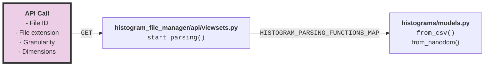

# Histogram File Manager API

Documentation on the `api` folder in the `histogram_file_manager` app. 

## Viewsets

### `HistogramDataFileViewSet`

This ViewSet provides the Views of the API to the `HistogramDataFile` model,
i.e. the endpoints which list the available instances of the aforementioned model.

#### `start_parsing`

A custom endpoint action which, given the `id` of the `HistogramDataFile` and
the appropriate information, calls the appropriate parsing function to extract
the contents of the file.

The function makes use of the defined `HISTOGRAM_PARSING_FUNCTIONS_MAP` dictionary which is a dictionary 
mapping each combination of **filetype**, **dimensionality** and **granularity** to the
appropriate parsing function, located in the respective model instances that the method
will create.

!!! info "Example"

	For filetype `csv`, dimensionality `2` (2D data) and granularity `lum`
	(Lumisection), the appropriate
	function is: `histograms.models.LumisectionHistogram2D.from_csv`.
	
!!! info "Adding methods for new file types or products"
	
	Expanding the `HISTOGRAM_PARSING_FUNCTIONS_MAP` should be straightforward 
	once the parsing functions are implemented. They just need to be placed as values under
	the appropriate keys of the dictionary.
	
	E.g. For a `test` file type, with data dimensionality `2` and granularity `lum`,
	the dictionary should be expanded as follows:
	```python3
	HISTOGRAM_PARSING_FUNCTIONS_MAP = {
		HistogramDataFile.FILETYPE_CSV: {
			HistogramDataFile.DIMENSIONALITY_1D: {
				HistogramDataFile.GRANULARITY_LUMISECTION: LumisectionHistogram1D.from_csv
			},
			HistogramDataFile.DIMENSIONALITY_2D: {
				HistogramDataFile.GRANULARITY_LUMISECTION: LumisectionHistogram2D.from_csv
			},
		},
		# New filetype defined below
		HistogramDataFile.FILETYPE_TEST: {
			HistogramDataFile.DIMENSIONALITY_2D: {
				HistogramDataFile.GRANULARITY_LUMISECTION: LumisectionHistogram2D.from_test
			},
		}		
	}	
	```
	In this example, you should also define `FILETYPE_TEST` in the [`HistogramDataFile` model](models.md).

An depiction of the flow described above can be found below:



