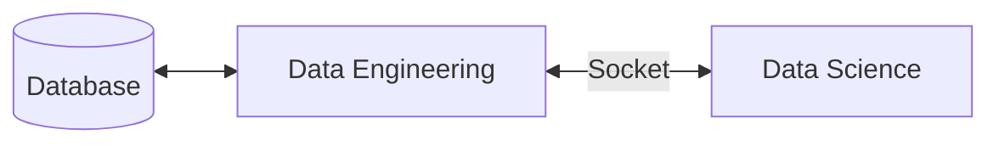

# Connectivity



## Kedro pipeline trigger

The `dqm-playground-ds` deployment runs using a wrapper script (`entrypoint.py`)
which listens on port 8888 for incoming socket clients.

A connected client can send commands to this server, which can trigger kedro
pipelines.


This server can be accessed (from within the PaaS cluster only)
using the hostname provided by PaaS'
[Services](https://paas.cern.ch/k8s/ns/ml4dqm-playground/services/dqm-playground-ds).

For example, to test the interconnection between deployments on PaaS,
one can execute from a `ml-playground` pod terminal:

```bash
curl dqm-playground-ds:8888
```

To verify that a response is received and the port is open.
