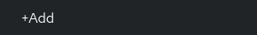

# Deployment Guide

The following steps will guide you through the deployment procedure of the app on OpenShift.
An overview of the steps is:

1. [Create a new PaaS project](./#requesting-a-website)
2. [Setup the base image & the repository that will be used](./#setup-procedure)
4. [Setup a Database](./#setup-a-database)
3. [Setup Environmental Variables](./#setup-environmental-variables)
4. [Setup a Django superuser](#create-a-superuser)
5. [Mount EOS Storage](./#mount-eos-storage)
6. [Single Sign-On](./#single-sign-on)
7. [Deploy](./#deploying-a-new-build)
8. [Expose the app](./#exposing-the-app)

The procedure can be done completely via the web UI provided by PaaS.

## Prerequisites


### `.s2i` directory inside the root of your repository

We will be using the Software To Image ([s2i](../../basic-concepts.md#s2i-source-to-image))
approach to deploy on PaaS,
namely the [Python flavor](../../basic-concepts.md#python-s2i).
This means that a Docker image is created from our repository on each deployment.

There should be a ``.s2i`` directory inside your repository, with the ``environment`` file in it.

#### `environment` contents

These are environmental variables used by Openshift when creating the
Docker image. The value of ``APP_SCRIPT`` will be the entrypoint of the created image.
It should point to `openshift-start-up-script.sh`.

## Requesting a website

Create a new PaaS project by clicking
[here](https://paas.docs.cern.ch/1._Getting_Started/1-create-paas-project/).
Then, fill out the fields as shown below:


When creating a website, different site types can be chosen. In
order to use the OpenShift software, the `PaaS Web Application` option
has to be selected.

## Setup Procedure

Once the website is successfully requested, the (new, empty) project should be
available in OpenShift.

### Create the base image

MLPlayground needs `ROOT` in order to read data from `.root` files. 
To do so, a `ROOT` installation is needed in the base image that we're
going to build MLPlayground in. Usually, we use `python3.8-ubi8`, but
after lots of failed experimenting with
[pre-built `ROOT` packages](https://root.cern/install/#centos), it
appears that it's "simpler" to [build it from source](https://root.cern/install/#build-from-source).

For this reason, we are using a `python3.8-ubi8` image as base, on top
of which we use a `Dockerfile` which:

- Installs all `ROOT` dependencies,
- Builds `ROOT` from source.

!!! note

	These instructions are adapted from the tutorial [here](https://paas.docs.cern.ch/2._Deploy_Applications/Deploy_From_Git_Repository/4-add-oracle-client-to-s2i/#create-a-buildconfig-to-customize-the-base-s2i-image).

1. Open [PaaS](https://paas.cern.ch) and select your project.
   There should be no resources there:

	
	
2. Click on the "+" sign, on the top-right:

	
	
3. Add the following in the YAML editor that appears:
   ```yaml
   apiVersion: image.openshift.io/v1
   kind: ImageStream
   metadata:
     name: python-with-root
   ```
   And click `Create`. The new base image we will be creating
   will be called `python-with-root`, as specified in the YAML above.
   
4. Click the "+" sign again, to create a new YAML.
5. Paste the following contents in the new editor:
   ```yaml
   apiVersion: build.openshift.io/v1
   kind: BuildConfig
   metadata:
     name: python-with-root
   spec:
     resources:
       limits:
         cpu: '2'
         memory: 4Gi
       requests:
         cpu: '2'
         memory: 4Gi
     output:
       to:
         kind: ImageStreamTag
         name: python-with-root:latest
     strategy:
       dockerStrategy:
         from:
           kind: ImageStreamTag
           name: python:3.8-ubi8
           namespace: openshift
       type: Docker
     source:
       type: Git
       git:
         uri: 'https://github.com/CMSTrackerDPG/MLplayground.git'
     triggers:
       - type: GitHub
         github:
           secret: <??>
       - type: Generic
         generic:
           secret: <??>
       - type: ConfigChange
       - type: ImageChange
         imageChange: {}
   ```
   This YAML specifies that we are using `python:3.8-ubi8` as the base image,
   with the extra steps configured in the `source` parameter. The result will
   be stored under the name `python-with-root:latest`.
   Note that we are using the custom `Dockerfile` found [here](https://github.com/CMSTrackerDPG/MLplayground/blob/master/Dockerfile), as specified under `source`-->`git`.
   This `Dockerfile` builds a Python image with `ROOT` installed.
   
6. Go to `Builds` and click the `python-with-root` `BuildConfig`.
7. Under the `Environment` tab, add a `ROOT_TAG_NAME` variable, with the value `v6-24-08`. This is
   the `ROOT` version to be installed:
   
   `v6-24-08` seems to work with the `python3.8` image.
8. Under `Actions`, on the top-right, click `Start build`:

	
	
9. After _several_ hours, the build of the base image should be complete.
	
### Create the s2i build

Now, once we have created the [base image](#create-the-base-image) and it
has finished building, we are ready to deploy our application on top
of the base image.

!!! note

	Adapted from [here](https://paas.docs.cern.ch/2._Deploy_Applications/Deploy_From_Git_Repository/4-add-oracle-client-to-s2i/#create-application-using-the-customized-base-image).

The following steps need to be done in order to
configure the web application with the GitHub repository:

1. Go to [PaaS](https://paas.cern.ch).
2. Select the project you created

	
	
3. Click on "Add" on the left

	
	
4. choose ``Git Repository``

	
	
5. Paste the repository URL in the field provided.
6. 
6. Under ``Advanced Git options``, you may select a specific branch, if needed. E.g. for the 
development mlplayground instance, the `develop` branch must be selected.
7. Under ``Advanced Git options``, you will be warned that `Multiple import strategies detected`. 
   Click on `Edit Import Strategy` and select `Builder Image`. Next, select `Python`, and
   the proper `Builder Image version`:
	
	
	!!! info
		
		As of writing, we select ``3.8-ubi8``.
	   
8.  Under **General**, change the **Application name** and **Name** appropriately. 
9.  Under **Resources**, select **Deployment**

	
			   
10. [Optional] Add GitHub credentials at "Source Secret" *if the repository is
    private*
	
11. Make sure that *Create a route to the Application* is ticked.
12. Under *Show advanced Routing options*:
	a. Paste the **Hostname** you want (will be automatically registered),
	b. Make sure *Secure Route* is ticked,
	c. Under **TLS termination**, select `Edge`,
	d. Under **Insecure Traffic**, select `Redirect`.
13. Click on **Create**. The application has been configured!

	!!! note
		
		Under **Topology**, you will see your project trying to run for the first time.
		This will fail, since most environmental variables are missing. Click on the
		main app:
		
		
		
		You should be getting the following error:
		
		
		
14. We now also need to change the base image used to build our app.
	Go to `Builds`, select the `BuildConfig` you just created (e.g. `mlplayground-develop`),
	and click the `YAML` tab. Navigate to `spec`>`strategy`>`sourceStrategy`>`from` and change
	the `namespace` to the name of the project you created (e.g. `ml4dqm-playground-dev`) and
	the `name` to `python-with-root:latest`, where `python-with-root` is the base image you 
	created in the previous section. 
	
	
	
	!!! warning
		
		The base image must have finished building before you can build your application.
		
		
## Setup a Database

The database was requested from the CERN
[DB on demand service](https://dbod.web.cern.ch/). To request one, 
follow the instructions [here](https://dbod-user-guide.web.cern.ch/instance_creation/).

A PostgreSQL database is used.

After the database has been requested it can be used straight away.
Django takes care of creating the necessary tables and only requires the
credentials.

### Actions to take once the database is ready

!!! warning

	This is only needed if you just requested a new Database
	instance from the DBoD website.

#### Change default password

Given the username that was sent to you via the DBoD Service,
(possibly `admin`) connect to the database:

```bash
psql -h dbod-birdup.cern.ch -U admin -p 6601
```

And run:

```sql
ALTER ROLE admin WITH PASSWORD 'new_password';
```

#### SSL Configuration

!!! error

	``` bash
	django.db.utils.OperationalError: connection to server at 
	"<host>" (<ip>), port 6601 failed: FATAL:  no pg_hba.conf entry for host "<ip>"
	```

Follow the instructions [here](https://dbod-user-guide.web.cern.ch/instance_management/ssl/postgres/)
to edit the required configuration files using
[the file editor](https://dbod-user-guide.web.cern.ch/instance_management/configuration_files/).

#### Create the database

Assuming that the [database name](#setup-environmental-variables)
you are going to use is `certhelperdb`
(i.e. `DJANGO_DATABASE_NAME` is `certhelperdb`), you will need to 
create it manually first.

To do so, you will have to first connect to it using `psql`[^1]:
[^1]: You will either have to do that through LXPLUS, or your computer must
	be inside CERN. You can always use an SSH tunnel for that.


```bash
psql -h <Database hostname> -p <Database port> -U <Database user>
```

Then, in the SQL prompt, run the following to create the database:

```sql
CREATE DATABASE certhelperdb;
```

and enter your password once prompted.		

## Setup Environmental Variables

This procedure takes place on PaaS, via the `Developer` view.

0. Under `Secrets`, click `Create`>`Key/value secret`:
     - `Secret name`: `postgres-user`
     - `Key`: `user`
     - `Value`: Your PostgreSQL database's username.
     - Click `Add key/value`.
     - `Key`: `password`
     - `Value`: Your PostgreSQL database's password.
     - Click `Create`.
1. Under `Builds --> Your project name --> Environment` use the
   `Add from ConfigMap or Secret` button to add the variables:

	```
	DJANGO_DATABASE_USER       <postgres-user/user>
	DJANGO_DATABASE_PASSWORD   <postgres-user/password>
	```

2. Non-secret variables:
    1. `DJANGO_SECRET_KEY`: Generate a django secret key.
    1. `DJANGO_ALLOWED_HOSTS`: The app's URL _without_ "https://",  e.g `ml4dqm-playground-develop.web.cern.ch`.
	1. `DJANGO_DATABASE_ENGINE`: `django.db.backends.postgresql`
	1. `DJANGO_DATABASE_NAME`: The name of the database that is going to
		be used in your PostgreSQL instance. **Note: You will have to
		create the database yourself, via `psql` or `pgadmin`.**
	1. `DJANGO_DATABASE_HOST`: `dbod-mlplaygrounddb.cern.ch`
	1. `DJANGO_DATABASE_PORT`: The port that the DBoD service gave to you.
	1. `DIR_PATH_DQMIO_STORAGE`: The colon-separated paths pointing to the directories
		that are going to be searched for DQM files.
	1. `DJANGO_DEBUG`: `False`, or `True` if you need to temporarily do some testing.
	1. `CSRF_TRUSTED_ORIGINS`: Your full app's URL _with_ "https://", e.g. `https://ml4dqm-playground-develop.web.cern.ch`.
	1. `SITE_ID`: Empty, until [Single Sign-On](#single-sign-on) is configured.

3. Save the variables and rebuild the project:
	
	
!!! note

	The procedure above should only be followed once.
	Once the app is fully configured, you should not have to alter anything,
	unless a change occurs (e.g. Database host/password).
	
!!! note
	
	More information on the environmental variables can be found [here](../config.md#environmental-variables).


## Mount EOS Storage

The project has 1 TB of storage associated in the EOS. To mount it to
OpenShift follow these instructions.

Detailed instructions can be found on the
[PaaS docs](https://paas.docs.cern.ch/3._Storage/eos/).
## Create a superuser

### Open a terminal in the running pod

1. Go to PaaS and, in the `Developer` view, click `Topology`:

    

2. Click on the application shown there:
   
    
   
3. On the right, in the `Pods` section, click `View logs`:

	
	
4. Click the `Terminal` tab:

	
	
5. Run `source root/bin/thisroot.sh`. This is needed to `import ROOT` in `python` later.

### Run the Django management command

In the terminal you opened in the previous section, run `python manage.py createsuperuser` to create the superuser.
You will be asked for a `username`, a `password` and an `e-mail` (the latter is optional).

## Single Sign-On

### CERN Setup

<!-- While the following seems to be the "new" method to do it, it does not work -->
<!-- * Visit the [application portal](https://application-portal.web.cern.ch/). -->
<!-- * Edit your application (e.g. `webframeworks-paas-certhelper`). -->
<!-- * Click on `SSO Registration` and generate an `OpenID Connect` provider. -->
<!-- * Note the `Client ID` and `Client Secrets`. -->

2. Generate a random 32-characters long alphanumeric identifier (e.g. [here](https://www.gigacalculator.com/randomizers/random-alphanumeric-generator.php)).
3. Click [here](https://sso-management.web.cern.ch/OAuth/RegisterOAuthClient)
to visit the **deprecated but still working** SSO registration page.
4. Enter the generated string in the `client_id` field.
5. Enter the full URL to your application in the `redirect_uri` field, followed by `/accounts/cern/callback/`,
e.g. `https://ml4dqm-playground-develop.web.cern.ch/accounts/cern/login/callback/`.
6. Click `Generate` next to the `secret`. **Note the generated string.**
7. Enter the full URL to your application in the `Application Homepage` field.
8. Enter a simple description in the `Application description` field.
9. Click `Send Registration Request`.
10. You should see an `Client registered successfully.` message.


!!! note

	Do **not** use the `Identifier` which is automatically generated by 
	PaaS (found in the [application portal](https://application-portal.web.cern.ch/)).
	For some reason it does not work out of the box with `django-allauth`,
	so you will need to generate a random string to use instead.

### Integration

The single sign-on integration is very easy when using the
`django-allauth` python package, which has built-in CERN support.

!!! note

	Based on  the installation procedure
	[here](https://django-allauth.readthedocs.io/en/latest/installation.html).
	
1. If you have not yet created a Django `superuser` for your database yet, [create one](#create-a-superuser).
2. Log into the `admin` site of your application using the `superuser` account.
3. On the left, go to `Sites` and add a new entry, using the full URL of your app:
   
4. Then, go to `Social applications` and add a new entry, selecting `Cern` as a `Provider` and
   using the `client_id` and `secret` you noted in the previous section:
   
5. Verify the `SITE_ID` value by checking the database itself. E.g. it might ge `1` or `2`. To do that,
   you will first have to [open a terminal on a running pod](#open-a-terminal-in-the-running-pod).
   Run `python manage.py shell`. In the prompt that appears, run the following:
   ```python
   from django.contrib.sites.models import Site
   
   print(Site.objects.all()[0].id)
   ```
   The number printed on the terminal is your `SITE_ID`. Use it to update
   the [environmental variable](#setup-environmental-variables)

## Deploying a new build

If you want to rebuild the deployment, you can
do so manually by triggering a build on PaaS.

This can be done by visiting
[paas.cern.ch](https://paas.cern.ch/), selecting the `Developer` view, selecting the
project and then visiting `Builds`. Click the three dots on the right
of your `BuildConfig` and press the `build` button. The new deployment process should be
started. In the meantime, the logs of the build process can be viewed by
clicking on `View Log`.

## Exposing the app

See the [PaaS docs](https://paas.docs.cern.ch/5._Exposing_The_Application/2-network-visibility/)
on how to make the app visible from outside the CERN GPN.
