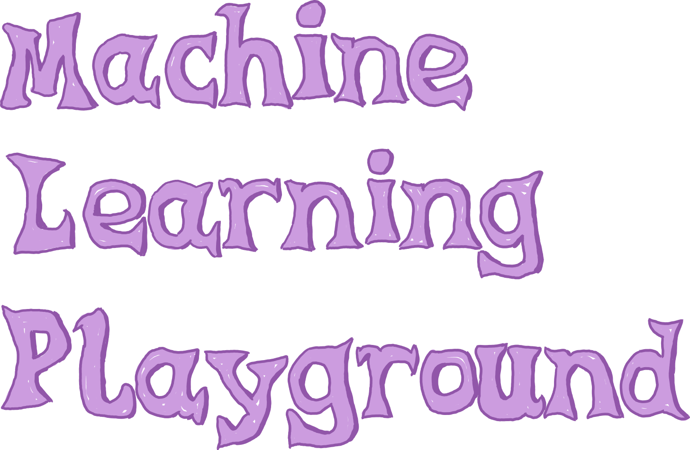

# Introduction

!!! todo

	TODO
	

## Composition

The project is comprised of the Data Engineering part (DE) and
the Data Science part (DS). Each one has its own repository:

* [Data Engineering repository](https://github.com/cmstrackerdpg/mlplayground)
* [Data Science repository](https://github.com/XavierAtCERN/dqm-playground-ds/)
